# Chapter 10. HTTP/2.0

# 1. HTTP/2.0 등장 배경

HTTP/1.1는 커넥션 하나를 통해 요청 하나를 보내고 그의 대해 응답 하나만을 받는 HTTP의 메시지 교환 방식이었다. 단순함 면에서는 좋지만 응답을 받아야만 그다음 요청을 보낼 수 있기 때문에 심각한 회전 지연(latency)을 피할 수 없었다. 이 문제를 해결하기 위해 병렬 커넥션 또는 파이프라인 커넥션이 도입됐지만 성능 개선에 대한 근본적인 해결은 안 됐다.

# 2. HTTP/2.0

HTTP 2.0은 기존 HTTP 1.1 버전의 성능 향상에 초점을 맞춘 프로토콜이다. 인터넷 프로토콜 표준의 대체가 아닌 확장으로써, HTTP 1.1의 성능 저하 부분과 비효율적인 것들을 개선되어 탄생한 것이 HTTP 2.0라고 생각하면 된다.

HTTP 2.0은 서버와 클라이언트 사이의 TCP 커넥션 위에서 동작한다. 이때 TCP커넥션을 초기화하는 것은 클라이언트다. 요청과 응답은 길이가 정의된 (최대 16383바이트) 한 개 이상의 프레임에 담긴다. 이때 **HTTP 헤더는 압축되어 담긴다. 프레임들에 담긴 요청과 응답은 스트림을 통해 보내진다. 한 개의 스트림이 한 쌍의 요청과 응답을 처리한다. 하나의 커넥션 위에 여러 개의 스트림이 동시에 만들어질 수 있으므로, 여러 개의 요청과 응답을 동시에 처리하는 것 역시 가능하다.**

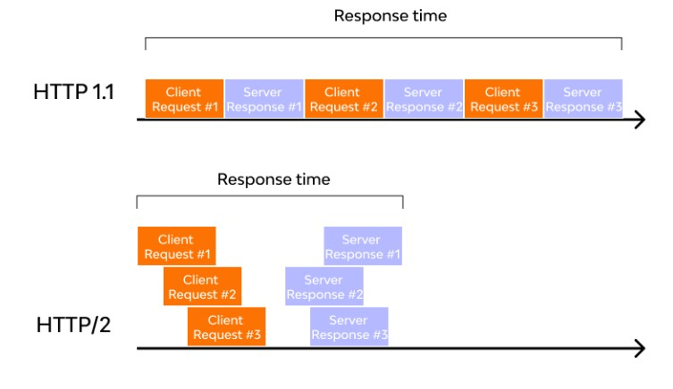

HTTP 2.0은 기존의 요청-응답과는 약간 다른 새로운 상호작용 모델인 서버 푸시(server-push)를 도입했다. 이를 통해 서버는 클라이언트에게 **필요하다고 생각하는 리소스라면 그의 대한 요청을 명시적으로 받지 않더라도 능동적으로 클라이언트에게 보내줄 수 있다.**

기존 웹 애플리케이션들과 호환성을 최대한 유지하기 위해, HTTP 2.0은 요청과 응답 메시지의 의미를 1.1과 같도록 유지하고 있다.

# 3. ****SPDY 프로토콜****

사실 HTTP/2.0의 원조는 구글이 만든 새로운 프로토콜인 2009년 중반에 발표된 **SPDY(스피디)** 이다.

HTTP/1.1의 메시지 포맷은 구현의 단순성과 접근성에 주안점을 두고 최적화 된 프로토콜이다 보니 성능은 어느 정도 희생시키지 않을 수 없었다. 때문에 더 효율적이고 빠른 HTTP가 필요했고, 이러한 요구에 만들어진 것이 구글의 SPDY 프로토콜이다.

SPDY는 HTTP를 대체하는 프로토콜이 아니고 HTTP를 통한 전송을 재 정의하는 형태로 구현 되었다. 그래서 전송 계층의 구현만 변경하면 기존 HTTP 서버 프로그램을 그대로 SPDY에서 사용할 수 있었다.

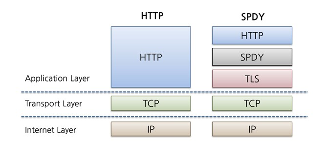

혁신적인 성능 향상에 힘입어 SPDY를 사용하는 사이트가 늘어나게 되었고, 이러한 상황을 주시하고 있던 HTTP-WG(HTTP working group)는 HTTP/2 표준을 선보이려는 노력을 했고 이 프로토콜의 초안을 SPDY 프로토콜을 채택하였다.

이렇게 2012년부터 2015년까지 3년간의 노력으로 **HTTP/2 표준**이 발행되게 되었다. 그리고 몇년간 함께 발전해온 SPDY는 지원을 중단하며, HTTP2가 널리 채택된다는 말을 남기고 사라지게 되었다.

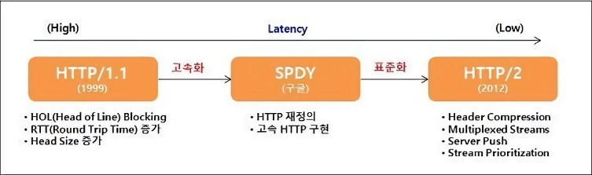

# 4. ****HTTP 2.0 개선점****

## 4.1 ****Binay Framing Layer****

HTTP 1.1과 HTTP 2.0의 주요한 차이점은 HTTP 메세지가 1.1에서는 text로 전송되었던 것과 달리, 2.0에서는 binary frame로 인코딩되어 전송된다는 점이다.

<aside>
💡 기존 text 방식으로 HTTP 메세지를 보내는 방식은, 본문은 압축이 되지만 헤더는 압축이 되지 않으며 헤더 중복값이 있다는 문제 때문에 HTTP 2.0에서는 바이너리로 변경 되었다.

</aside>

또한 HTTP 헤더에 대해서 배웠을 때 헤더와 바디를 \r 이나 \n 과 같은 개행 문자로 구분한다고 하였는데, HTTP/2.0에서 부터는 헤더와 바디가 **layer**로 구분된다.

이로인해 데이터 파싱 및 전송 속도가 증가하였고 오류 발생 가능성이 줄어들었다.

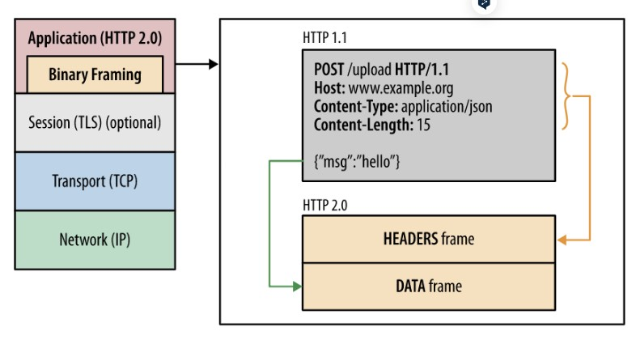

### 4.1.1 ****Stream 과 Frame 단위****

HTTP/1.1에서는 HTTP 요청와 응답은 통짜 텍스트 Message 단위로 구성되어 있었다.

HTTP/2 로 오면서 Message라는 단위 외에 Frame, Stream이라는 단위가 추가되었다.

- **Frame** : HTTP/2에서 통신의 최소 단위이며, Header 혹은 Data 가 들어있다.
- **Message** : HTTP/1.1과 마찬가지로 요청 혹은 응답의 단위이며 다수의 Frame으로 이루어진 배열 라인
- **Stream** : 연결된 Connection 내에서 양방향으로 Message를 주고 받는 하나의 흐름

즉, HTTP/2 는 HTTP 요청을 여러개의 Frame들로 나누고, 이 frame들이 모여 요청/응답 Message가 되고, 그리고 Message는 특정 Stream에 속하게 되고, 여러개의 Stream은 하나의 Connection에 속하게 되는 구조이다.

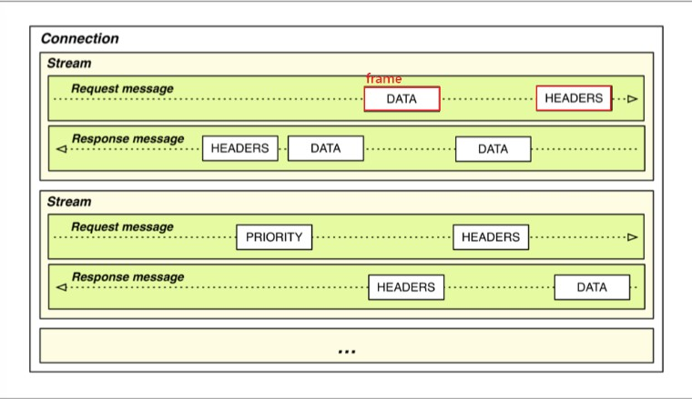

이처럼 **프레임** 단위로 이루어진 요청과 응답 **메세지**는 하나의 **스트림**을 통해 이루어지며, 이러한 스트림들이 하나의 **커넥션** 내에서 병렬적로 처리된다. 하나의 커넥션에서 여러개의 스트림이 동시에 열리니 속도가 빠를수밖에 없다.

<aside>
💡 **스트림(stream)의 깊은 이해**

- 모든 스트림은 31비트의 무부호 정수로 된 고유한 식별자를 갖는데, 스트림이 클라이언트에 의해 초기화되었다면 이 식별자는 반드시 홀수여야 하며 서버라면 짝수를 갖는 식으로 요청 스트림인지 응답 스트림인지 구분을 둔다.
- 새로 만들어지는 스트림의 식별자는 이전에 만들어졌거나 예약된 스트림들의 식별자보다 커야 한다.
- 한번 사용한 스트림 식별자는 다시 사용할 수 없다.
- 하나의 커넥션에서 오래 스트림을 사용하다보면 스트림에 할당될 수 있는 식별자가 고갈되기도 하는데, 그런 경우 커넥션을 다시 맺는 식으로 처리한다.
</aside>

## 4.2 멀티플렉싱(****Multiplexing****)

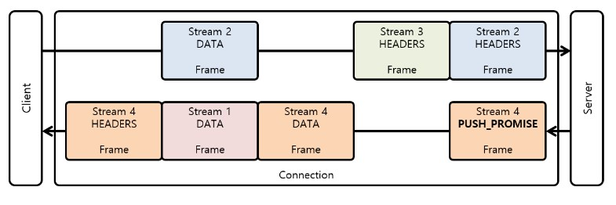

바로 위에서 frame - message - stream - connection 그림에서 봤듯이, HTTP 헤더 메세지를 바이너리 형태의 프레임으로 나누고 하나의 커넥션으로 동시에 여러개의 메세지 스트림을 응답 순서에 상관없이 주고 받는 것을 **멀티플렉싱(multiplexing)**이라고 한다.

- HTTP/1.1의 Connection Keep-Alive, Pipelining, Head Of Line Blocking을 개선했다.
- 회전 지연(latency)만 줄여주는게 아니라 결국 네트워크를 효율적으로 사용할 수 있게 하고 그 결과 네트워크 비용을 줄여준다.
- 특히 클라우드 시스템을 이용한다면 비용과 직결된다.

### 4.2.1 ****HTTP 1.1 통신 과정****

**HTTP 1.1**에서는 한 TCP 커넥션을 통해 요청을 보냈을 때, 그에 대한 응답이 도착하고 나서야 같은 TCP 커넥션으로 다시 요청을 보낼 수 있다. 따라서 웹브라우저들은 회전 지연을 줄이기 위해 여러 개의 TCP 커넥션을 만들어 동시에 여러 개의 요청을 보내는 방법을 사용하였다. 그러나 그렇다고 TCP 커넥션을 무한정 만들 수는 없기에, 한 페이지에 보내야 할 요청이 수십개에서 수백개에 달하는 요즘 시대에는 한계가 있었다.

1. Request 1을 전송 받기 위해 하나의 TCP Connection 1 을 열고 요청/응답한다.
2. 다음으로 Request 2, 3, 4을 요청하는데 빠르게 전송받기 위해 여러개의 커넥션 TCP Connection 2 와 TCP Connection 3을 만들어 요청/응답한다.
3. 하지만 커넥션을 무한정으로 만들수없어 이러한 방식은 한계가 존재한다.

### 4.2.2 ****HTTP 2.0 통신 과정****

**HTTP 2**에서는 하나의 커넥션에 여러 개의 스트림이 동시에 요청/응답 한다.

HTTP 1.1은 요청과 응답이 메시지라는 단위로 구분되어 있었지만, HTTP 2부터는 Stream을 통해 요청과 응답이 묶일 수 있어 다수 개의 요청을 병렬적으로 처리가 가능해졌다. 따라서 응답 프레임들은 요청 순서에 상관없이 먼저 완료된 순서대로 클라이언트에 전달이 가능하다.

1. Request 1을 전송 받기 위해, 우선 Framing Layer을 통해 바이너리 프레임 단위로 쪼개고 하나의 TCP Connection을 만들고 통신한다.
2. 다음으로 Request 2, 3, 4을 요청하는데 기존의 커넥션을 이용하며, 쪼개진 프레임들은 메세지 통로를 통해 동시다발적으로 요청/응답 받는다.
3. 커넥션 낭비도 없고 병렬적으로 자원이 전송받기에 매우 빠르다.

## 4.3 서버 푸시(server-push)

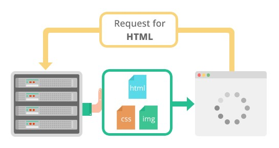

HTTP 2.0에서는 클라이언트의 요청에 대해 미래에 필요할것 같은 **리소스를 똑똑하게 미리 보낼 수 있다.**

예를 들어 클라이언트로부터 HTML 문서를 요청하는 하나의 HTTP 메세지를 받은 서버는 그 HTML 문서가 링크하여 사용하고 있는 이미지, CSS 파일, JS 파일 등의 리소스를 스스로 파악하여 클라이언트에게 미리 push해서 미리 브라우저의 캐시에 가져다 놓는다.

즉, 서버는 요청하지도 않은 리소스를 미리 보내어 가까운 미래에 특정 개체가 필요할때 바로 사용 되도록 성능 향상을 이끌어 내는 것이다. 그래서 클라이언트가 HTML 문서를 파싱해서 필요한 리소스를 다시 요청하여 발생하게 되는 트래픽과 회전 지연을 줄여준다는 장점이 있다.

1. 서버가 클라이언트로부터 Request 1을 전송 받으면, index.html 에 있는 자원들을 파싱한다.
2. 클라이언트가 따로 요청하지 않아도, 서버가 알아서 미리 자원들을 클라이언트에 보낸다.
3. 따라서 총 로드 시간이 줄어드는 이점이 있다.

## 4.4 스트림 우선순위(Stream prioritization)

HTTP 1.1에서 파이프라이닝 이라는 혁신적인 기술이 있었지만, 우선 순위 문제 때문에 HOLB(Head Of Line Blocking)가 발생하여 사장되었다.

HTTP 2에서는 **리소스간 의존관계(우선순위)를 설정**하여 이런 문제를 해결하였다.

위에서 봤던 것 처럼 HTTP 메세지가 개별 바이너리 프레임으로 분할되고, 여러 프레임을 멀티플렉싱 할 수 있게 되면서 요청과 응답이 동시에 이루어져 비약적인 속도 향상이 되었다.

하지만 하나의 연결에 여러 요청과 응답이 뒤섞여 버려 패킷 순서가 엉망 징창이 되었다. 따라서 스트림들의 우선순위를 지정할 필요가 생겼는데, 클라이언트는 **우선순위 지정 트리**를 사용하여 스트림에 식별자를 설정함으로써 해결 하였다.

- 각각의 스트림은 1-256 까지의 가중치를 갖음
- 하나의 스트림은 다른 스트림에게 명확한 의존성을 갖음

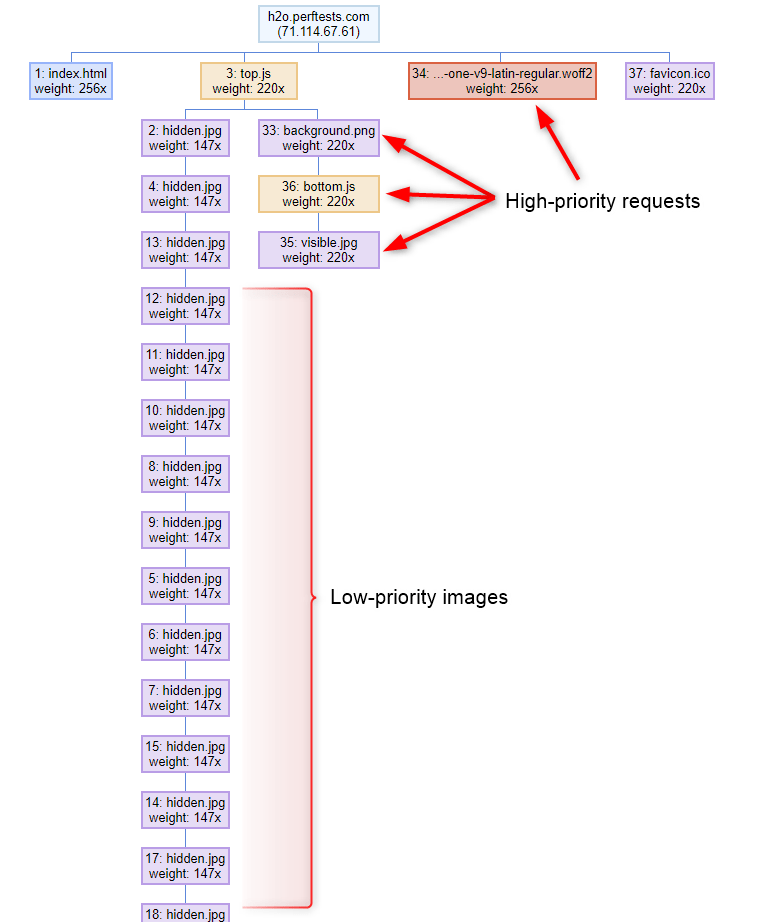

*참고 : [https://calendar.perfplanet.com/2018/http2-prioritization/](https://calendar.perfplanet.com/2018/http2-prioritization/)
[https://blog.cloudflare.com/better-http-2-prioritization-for-a-faster-web/](https://blog.cloudflare.com/better-http-2-prioritization-for-a-faster-web/)

### 4.4.1 스트림 우선순위 통신 과정

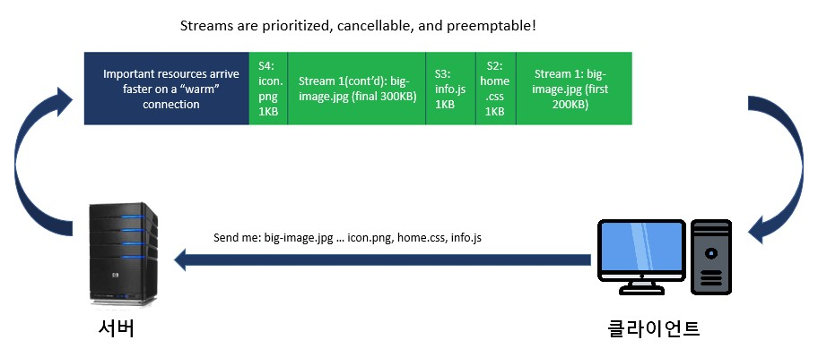

1. 클라이언트는 서버에게 스트림을 보낼때, 각 요청 자원에 가중치 우선순위를 지정하고 보낸다.
2. 그렇게 요청 받은 서버는 우선순위가 높은 응답이 클라이언트에 우선적으로 전달될 수 있도록 대역폭을 설정한다.
3. 응답 받은 각 프레임에는 이것이 어떤 스트림인지에 대한 고유한 식별자가 있어, 클라이언트는 여러개의 스트림을 interleaving을 통해 서로 끼워놓는 식으로 조립한다.

<aside>
💡 우선순위에 따르는 것은 의무사항이 아니기 때문에, 요청이 우선순위대로 처리된다는 보장은 없다.

 최신 브라우저들은 자원의 종류, 페이지가 로드된 위치 그리고 이전 페이지 방문에서 학습한 결과에 따라 자원 요청의 우선순위를 결정하기도 한다.

</aside>

## 4.5 헤더 데이터 압축(****Header Data Compression)****

HTTP 1.1 에서 헤더는 아무런 압축 없이 그대로 전송되었다. 이를 개선하기 위해 HTTP 2.0에서는 **HTTP 메시지의 헤더를 압축하여 전송**한다.

또한 HTTP 1.1 에서는 연속적으로 요청되는 HTTP 메세지들에게서 헤더값이 중복되는 부분이 많아 역시 메모리가 낭비되었는데, HTTP 2.0 에서는 이전 Message의 **헤더의 내용 중 중복되는 필드를 재전송하지 않도록**하여 데이터를 절약할 수 있게 되었다.

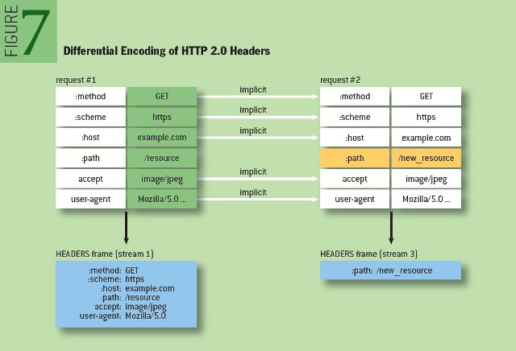

HTTP 1.x에서는 이 메타데이터가 항상 일반 텍스트로 전송되어 일반적으로 요청당 500바이트에서 800바이트의 오버헤드가 추가되며, HTTP 쿠키가 필요한 경우 이보다 훨씬 더 많은 오버헤드가 추가되기도 합니다. 이러한 오버헤드를 줄이고 성능을 개선하기 위해 **HTTP 2.0은 헤더 메타데이터를 압축합니다.(HPACK 압축 방식)**

- HTTP 2.0은 각 요청과 응답에 **동일한 데이터를 재전송하는 대신 클라이언트와 서버 모두에서 헤더 테이블을 사용하여 이전에 전송된 헤더 키-값 쌍을 추적하고 저장**합니다.
- **헤더 테이블은 전체 HTTP 2.0 연결 동안 지속**되며 클라이언트와 서버 모두에 의해 점진적으로 업데이트됩니다.
- 각각의 새로운 헤더 키-값 쌍은 기존 테이블에 추가되거나 테이블의 이전 값을 대체합니다.

결과적으로 HTTP 2.0 연결의 양쪽은 전송된 헤더와 이전 값을 알 수 있으므로 새 헤더 세트는 이전 세트와 단순한 차이로 코딩할 수 있습니다

# 5. ****HTTP 2.0 문제점****

## 5.1 왕복 시간(****RTT : Round Trip Time)****

아무리 혁신적으로 개선되었다 하더라도, HTTP 1.1 이나 HTTP 2는 여전히 **TCP를 이용**하기 때문에 Handshake의 RTT(Round Trip Time)로 인한 지연 시간(Latency)이 발생한다. 결국 원초적으로 TCP로 통신하는게 문제인 것이다.

*RTT 참고 : [https://medium.com/@su_bak/왕복-시간-round-trip-time-rtt-이란-96d78eea40b7](https://medium.com/@su_bak/%EC%99%95%EB%B3%B5-%EC%8B%9C%EA%B0%84-round-trip-time-rtt-%EC%9D%B4%EB%9E%80-96d78eea40b7)

## 5.2 ****TCP 자체의 HOLB (Head Of Line Blocking)****

HTTP 2에서 HTTP 1.1의 파이프라이닝 HOLB 문제를 멀티플렉싱(Multiplexing)을 통해 해결했다고 하였다.

하지만 기본적으로 TCP는 패킷이 유실되거나 오류가 있을때 재전송하는데, 이 재전송 과정에서 패킷의 지연이 발생하면 결국 HOLB 문제가 발생된다. TCP/IP 4 계층을 보면, 애플리케이션 계층(L4)에서 HTTP HOLB를 해결하였다 하더라도, 전송 계층(L3)에서의 TCP HOLB 를 해결한건 아니기 때문이다.

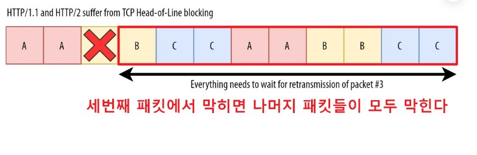

## 5.3 ****중개자 캡슐화 공격****

 HTTP 2.0은 헤더 필드의 이름과 값을 바이너리로 인코딩한다. 이를 다르게 말하면 HTTP 2.0 이 헤더 필드로 어떤 문자열이든 사용할 수 있게 해준다는 뜻이다.

그래서 이를 악용하면 HTTP 2.0 메시지를 중간의 Proxy 서버가 HTTP 1.1 메시지로 변환할 때 메시지를 불법 위조할수 있다는 위험성이 있다. 다행히 거꾸로 HTTP/1.1 메시지를 HTTP/2.0 메시지로 번역하는 과정에서는 이런 문제가 발생하지 않는다.

## 5.4 긴 ****커넥션 유지로 인한 개인정보 누출 우려****

HTTP 2.0은 기본적으로 성능을 위해 클라이언트와 서버 사이의 커넥션을 오래 유지하는 것을 염두에 두고 있다.

하지만 이것은 개인 정보의 유출에 악용될 가능성이 있다. 이는 HTTP/1.1에서의 Keep-Alive도 가지고 있는 문제이기도 하다.

# 6. ****HTTP 2.0을 개선한 HTTP 3.0****

HTTP 2.0의 문제점을 한마디로 요약하자면 **TCP가 문제**다. (**HTTP는 TCP 기반 위에서 동작된다**)

최근에 나온 HTTP 3.0 버전은 TCP를 버리고 UDP를 채택하였다. 정확히 말하면 UDP를 개조한 **QUIC 라는 프로토콜**을 새로 만들었다.

**기존 TCP는 클라이언트와 서버 간에 세션을 설정하기 위해 핸드쉐이크가 필요**하며, **인증서인 TLS도 세션이 보호되도록 자체 핸드셰이크도 필요**하다. 하지만 **QUIC는 보안 세션을 설정하기 위해 한 번의 핸드셰이크만 필요**하다. 아래 그림만 봐도 한번 통신하는데 드는 시간 세로축 차이가 어마어마하게 난다는 것을 볼 수 있다.

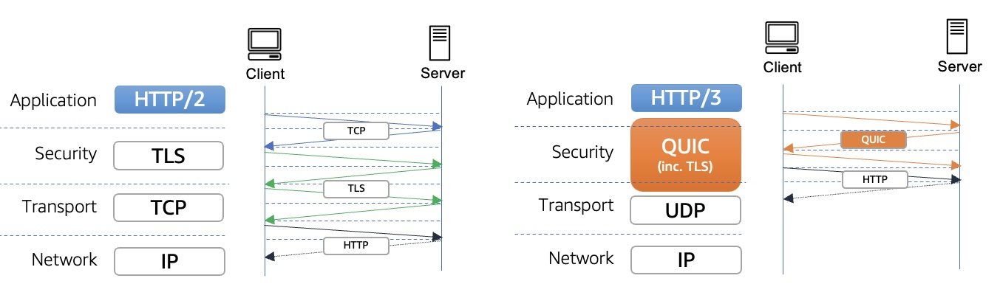