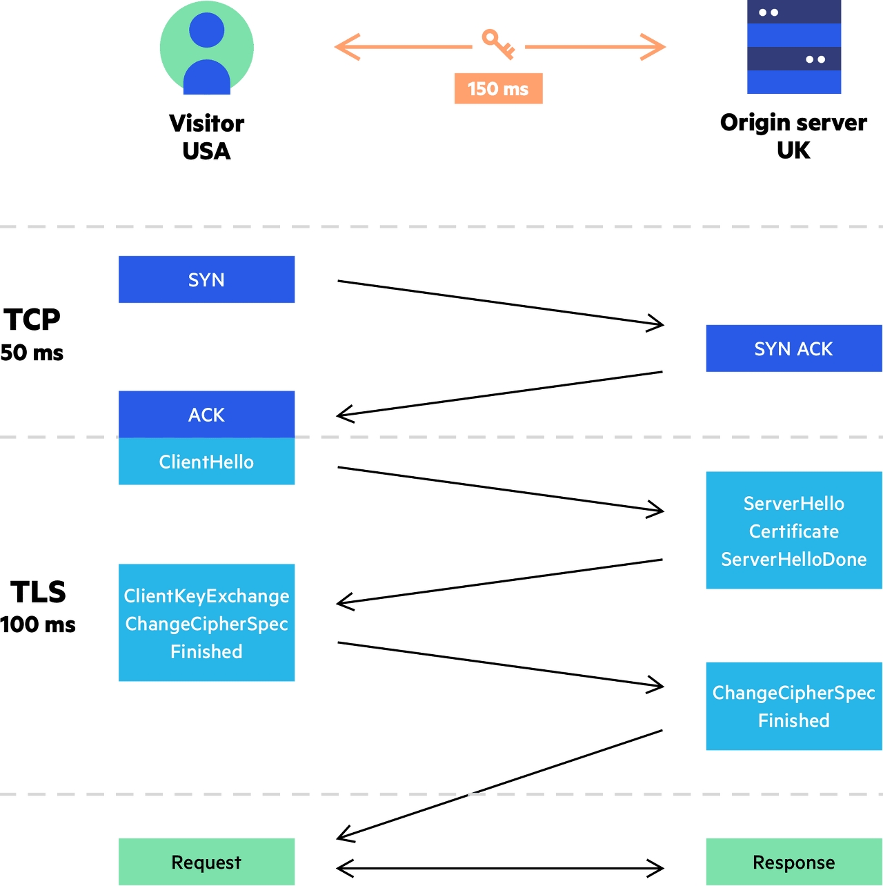
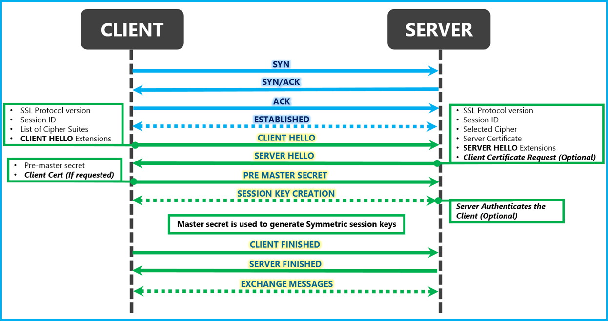

# Chapter 14. 보안 HTTP

사람들은 강력한 보안이 없다면 온라인 쇼핑이나 인터넷뱅킹을 할 때 안심할 수 없다. 또한 제한된 접근이 가능하지 않다면, 회사들은 중요한 문서를 웹 서버에 올려놓을 수 없다. 이런 일은 웹 트랜잭션으로 일어나는데 그만큼 웹 트랜잭션은 중요한 일에 사용하기에 안전한 방식의 HTTP를 필요하다.

중요한 트랜잭션을 위해서는 HTTP와 디지털 암호화 기술을 결합해야 한다. HTTP의 보안 버전은 효율적이고, 이식성이 좋아야 하고, 관리가 쉬워야 하며, 현실 세계의 변화에 맞게 적응력이 좋아야 한다. 

HTTP 보안 기술에 필요한 요소

- 서버 인증 - 클라이언트는 자신이 위조된 서버가 아닌 진짜와 이야기하고 있음을 알 수 있어야 한다.
- 클라이언트 인증 - 서버는 자신이 가짜가 아닌 진짜 사용자와 이야기하고 있음을 알 수 있어야 한다.
- 무결성 - 클라이언트와 서버는 그들의 데이터가 위조되는 것으로부터 안전해야 한다.
- 효율 - 알고리즘은 충분히 빨라야 한다.
- 편재성 - 프로토콜은 거의 모든 클라이언트와 서버에서 지원되어야 한다.
- 관리상 확장성 - 누구든 어디서든 즉각적인 보안 통신을 할 수 있어야 한다.
- 적응성 - 현재 알려진 최선의 보안 방법을 지원해야 한다.
- 사회적 생존성 - 사회의 문화적, 정치적 요구를 만족시켜야 한다.

https

HTTPS는 HTTP를 안전하게 만드는 방식 중에서 가장 인기 있다.

HTTPS를 사용할 때, 모든 HTTP 요청과 응답 데이터는 네트워크로 보내지기 전에 **암호화**된다. 
HTTPS는 HTTP의 하부에 보안 계층을 제공함으로써 동작하는데 이 보안 계층은 안전 소켓 계층(SSL) 혹은 그를 계승한 전송 계층 보안(TLS)을 이용하여 구현된다.

[http and https layers.jfif](http_and_https_layers.jfif)

인코딩 및 디코딩 작업은 대부분 SSL 라이브러리 안에서 일어나기 때문에 보안 HTTPS를 사용하기 위해 웹 클라이언트와 서버가 프로토콜을 처리하는 로직을 크게 변경할 필요가 없다. 대부분의 경우, TCP 입력/출력을 SSL 호출로 대체하고 보안 정보를 설정하고 관리하기 위한 몇 가지 호출을 추가하기만 하면 된다.

디지털 암호학

암호학의 기술과 용어들

- 암호 - 텍스트를 아무나 읽지 못하도록 **인코딩하는** 알고리즘
- 키 - 암호의 동작을 변경하는 숫자로 된 매개변수
- 대칭키 암호 체계 - 인코딩과 디코딩에 **같은 키**를 사용하는 알고리즘
- 비대칭키 암호 체계 - 인코딩과 디코딩에 **다른 키**를 사용하는 알고리즘
- 공개키 암호법 - 비밀 메시지를 전달하는 수백만 대의 컴퓨터를 쉽게 만들 수 있는 시스템
- 디지털 서명 - 메시지가 위조 혹은 변조되지 않았음을 입증하는 **체크섬**
- 디지털 인증서 - 신뢰할 만한 조직에 의해 서명되고 검증된 신원 확인 정보

암호법

암호법은 메시지 인코딩과 디코딩에 대한 기술이며 암호라 불리는 비밀 코드에 기반한다.

암호

암호란 **메시지를 인코딩하는 어떤 특정한 방법과 나중에 그 비밀 메시지를 디코딩하는 방법**이다. 인코딩되기 전의 원본 메시지는 흔히 텍스트 또는 평문이라 불린다. 암호가 적용되어 코딩된 메시지는 보통 암호문이라고 불린다.

암호 기계

암호는 상대적으로 간단한 알고리즘으로 시작했지만 암호를 깨뜨릴 수 있기에 사람들은 보다 복잡한 암호로 메시지를 빠르고 정확하게 인코딩하고 디코딩하는 기계를 만들었다.

키가 있는 암호

코드 알고리즘과 기계가 적의 손에 들어갈 수 있기에 대부분의 기계들에는 암호의 동작방식을 변경할 수 있는 숫자로 된 다른 값을 설정할 수 있는 키 값이 있는데 올바른 키 값이 없이는 디코더가 제대로 동작하지 않는다. 
이러한 암호 매개변수를 키라고 부른다. 디코딩 과정을 바르게 동작시키려면 올바른 키를 암호 기계에 입력해야 한다. 같은 텍스트라도 다른 키 값을 갖고 있으면 제각각 동작한다.
**오늘날 거의 대부분의 암호 알고리즘은 키를 사용한다.**

대칭키 암호법

많은 디지털 암호 알고리즘은 대칭키 암호라 불리는데 그 이유는 그들이 인코딩 할 때 사용하는 키가 디코딩을 할 때와 같이 때문이다. 대칭키 암호에서, 발송자와 수신자 모두 통신을 위해 **비밀 키**를 똑같이 공유할 필요가 있다. 발송자는 공유된 비밀 키를 메시지를 암호화하고 그 결과인 암호문을 수신자에게 발송하기 위해 사용한다. 수신자 또한 암호문을 받은 뒤 같은 공유된 키를 사용하여 원래의 평문을 복원하기 위해 해독 함수를 적용한다.

대부분의 경우, 인코딩 및 디코딩 알고리즘은 공개적으로 알려져 있으므로 키만이 유일한 비밀이기에 누설되면 안 된다. 좋은 암호 알고리즘은 공격자가 코드를 크래킹하려면 존재하는 모든 가능한 키 값을 시도해보는데 무차별로 모든 키 값을 대입해보는 공격을 **열거 공격**이라고 한다.

대칭키 암호의 단점 중 하나는 발송자와 수신자가 서로 대화하려면 둘 다 공유키를 가져야 한다는 것이다. 예로 클라이언트와 서버로 비유하자면 서로 소통하기 하기 위해 서버에서 비밀 키를 생성하고 그것을 기억해야 한다. 하지만 클라이언트는 다수이기에 서버는 다수의 키를 생성하고 기억해야 한다. 그렇기에 서버 입장에서는 리소스가 낭비된다.

공개키(비대칭키) 암호법

한 쌍의 호스트가 하나의 인코딩/디코딩 키를 사용하는 대신, 공개키 암호 방식은 두 개의 비대칭 키를 사용한다. 하나는 호스트의 메시지를 인코딩하기 위한 것이며, 다른 하나는 그 호스트의 메시지를 디코딩하기 위한 것이다. 인코딩 키는 모두를 위해 공개되어 있다. 하지만 호스트만이 개인 디코딩 키를 알고 있다. 즉, 모든 사람이 호스트(서버)에게 보내는 모든 메시지를 같은 키로 인코딩 할 순 있지만, 호스트(서버)를 제외한 누구도 그 메시지를 디코딩 할 수 없다. 

비대칭 공개키 암호 방식은 누구나 공개키만 알면 그 키에 대응되는 공개 서버에 안전하게 메시지를 보낼 수 있게 해주므로 흉륭하다. 두 노드가 안전하게 의사소통 하려고 할 때 개인 키에 대한 협상을 먼저 해야 할 필요가 없다.

그러나 공개키 암호 방식의 알고리즘은 계산이 느린 경향이 있다. 실제로는 대칭과 비대칭 방식을 섞은 것이 쓰인다. 예를 들어 노드들 사이의 안전한 의사소통 채널을 수립할 때는 편리하게 공개 키 암호를 사용하고 이렇게 만들어진 안전한 채널을 통해 임시의 무작위 대칭 키를 생성하고 교환하여 이후의 나머지 데이터를 암호화할 때는  빠른 대칭 키를 사용하는 방식이 흔히 쓰인다.

디지털 서명

암호 체계는 메시지를 암호화하고 해독하는 것뿐 아니라, 누가 메시지를 썼는지 알려주고 그 메시지가 위조되지 않았음을 증명하기 위해 메시지에 서명을 하도록 하는 데에 이용될 수 있다.

- 디지털 서명은 **메시지에 붙어있는 특별한 암호 체크섬**이다. 서명은 메시지를 작성한 저자가 누군지 알려준다. 저자는 개인 키를 갖고 있기 때문에 오직 저자만이 체크섬을 계산할 수 있다. 체크섬은 저자의 개인 ‘서명’처럼 동작한다.
- 서명은 메시지 위조를 방지한다. 만약 악의적인 공격자가 송신 중인 메시지를 수정했다면 체크섬은 더 이상 그 메시지와 맞지 않게 될 것이다. 그리고 체크섬은 저자의 비밀 개인 키에 관련되어 있기 때문에 침입자는 그 위조된 메시지에 대한 올바른 체크섬을 날조해낼 수 없다.
- 대지털 서명은 보통 비대칭 공개키에 의해 생성된다.

디지털 인증서

인터넷의 신분증인 디지털 인증서는 신뢰할 수 있는 기관으로부터 보증 받은 사용자나 회사에 대한 정보를 담고 있다. 또한 공식적으로 ‘인증 기관’에 의해 **디지털 서명된** 정보의 집합이 담겨 있다.

디지털 인증서에 포함되어 있는 기본적인 것들

- 대상의 이름
- 유효 기간
- 인증서 발급자 (누가 이 인증서를 보증하는가)
- 인증서 발급자의 디지털 서명

디지털 인증서는 대상과 사용된 서명 알고리즘에 대한 서술적인 정보뿐 아니라 보통 대상의 공개키도 담고 있다. 누구나 디지털 인증서를 만들 수 있지만 그 모두가 인증서의 정보를 보증하고 인증서를 개인 키로 서명할 수 있는 널리 인정받는 서명 권한을 얻을 수 있는 건 아니다.

X.509 v3

오늘날 사용되는 대부분의 인증서가 그들의 정보를 X.509라 불리는 표준화된 서식에 저장하고 있다.  X.509 v3 인증서는 인증 정보를 파싱 가능한 필드에 넣어 구조화하는 표준화된 방법을 제공한다. X.509 기반 인증서에는 웹 서버 인증서, 클라이언트 이메일 인증서, 소프트웨어 코드사인 인증서, 인증기관 인증서를 비롯한 몇 가지 변종이 있다.

서버 인증을 위해 인증서 사용하기

사용자가 HTTPS를 통한 안전한 웹 트랜잭션을 시작할 때 최신 브라우저는 자동으로 접속한 **서버에서 디지털 인증서를 가져온다**. 만약 서버가 인증서를 갖고 있지 않다면 보안 커넥션은 실패한다.

서버 인증서의 필드들

- 웹 사이트의 이름과 호스트 명
- 웹 사이트의 공개 키
- 서명 기관의 이름
- 서명 기관의 서명

HTTPS의 세부사항

HTTPS는 HTTP의 가장 유명한 보안 버전이다. 널리 구현되었으며 주류 사용 브라우저와 서버에 구현되어 있다. HTTPS는 HTTP 프로토콜에 대칭, 비대칭 인증서 기반 암호 기법이 강력한 집합을 결합한 것이다. HTTPS는 또한 분산된 웹 애플리케이션의 광역 보안 관리에 있어 대단히 중요하다.

HTTPS는 그냥 보안 전송 계층을 통해 전송되는 HTTP이다. 암호화되지 않은 HTTP메시지를 TCP를 통해 전 세계의 인터넷 곳곳으로 보내는 대신에 HTTPS는 HTTP 메시지를 TCP로 보내기 전에 먼저 그것들을 암호화하는 보안 계층으로 보낸다. 오늘날 HTTPS의 보안 계층은 **SSL과 그것의 현대적 대체품인 TLS로 구현**되었다.

HTTPS 스키마

오늘날 HTTPS는 선택적이다. 따라서 웹 서버로의 요청을 만들 때 클라이언트는 웹 서버에게 HTTP의 보안 프로토콜 버전을 수행한다고 말해줘야 한다.
만약 URL이 HTTP 스키마를 갖고 있다면 클라이언트는 서버에 80번 포트로 연결하고 평범한 HTTP 명령을 전송한다. 만약 URL이 HTTPS 스키마를 갖고 있다면 클라이언트는 서버에 443 포트로 연결하고 서버와 바이너리 포맷으로 된 몇몇 SSL 보안 매개변수를 교환하면서 ‘핸드셰이크’를 하고 암호환된 HTTP 명령이 뒤를 잇는다.

SSL 트래픽은 **바이너리 프로토콜**이기 때문에 HTTP와는 완전히 다르다. SSL 트래픽은 다른 포트(SSL은 보통 443 포트로 전달됨)로 전달한다. 만약 SSL과 HTTP 트래픽 모두 80번 포트로 도착하면 대부분의 웹브라우저는 바이너리 SSL 트래픽을 잘못된 HTTP로 해석하고 커넥션을 닫는다.

HTTPS 전송 절차

암호화되지 않은 HTTP에서 클라이언트는 웹 서버의 80번 포트로 TCP 커넥션을 열고 요청 메시지를 보내고 응답 메시지를 받고 커넥션을 닫는다.
반면, HTTPS는 SSL 보안 계층 때문에 약간 복잡하다. HTTPS에서 클라이언트는 먼저 웹 서버의 443 포트로 연결한다. **일단 TCP 연결이 되고** 나면 클라이언트와 서버는 **암호법 매개변수와 교환 키를 협상**하면서 **SSL 계층을 초기화**한다. 핸드셰이크가 완료되면 SSL 초기화가 완료되며 클라이언트는 요청 메시지를 TCP로 보내기 전에 보안 계층에서 암호화해서 전송한다.

SSL 핸드셰이크

암호화된 HTTP 메시지를 보낼 수 있게 되기 전에 클라이언트와 서버는 SSL 핸드셰이크를 한다.

SSL 핸드셰이크 동작

- 프로토콜 버전 번호 교환
- 양쪽이 알고 있는 암호 선택
- 양쪽의 신원을 인증
- 채널을 암호화하기 위한 임시 세션 키 생성

암호화된 HTTP 데이터가 네트워크를 오가기 전에 SSL은 통신을 시작하기 위해 많은 양의 핸드셰이크 데이터를 주고받는다.

서버 인증서

SSL은 서버 인증서를 클라이언트로 나르고 다시 클라이언트 인증서를 서버로 날라주는 상호 인증을 지원한다. 오늘날 클라이언트 인증서는 웹 브라우징에선 흔히 쓰이지 않는다. 대부분의 사용자는 개인 클라이언트 인증서를 갖고 있지 않는다. 단 몇몇 회사 설정에서 웹 브라우징을 위해 사용되며, 보안 이메일을 위해서도 사용되기도 한다. 
한편 HTTPS 트랜잭션은 항상 서버 인증서를 요구한다. 서버 인증서는 조직의 이름, 주소, 서버 DNS 도메인 이름, 그 외의 정보를 보여주는 X.509 v3에서 파생된 인증서이다. 그럼 사용자와 사용자의 클라이언트 소프트웨어는 확인해서 인증서를 검증할 수 있다.

사이트 인증서 검사

SSL 자체는 사용자에게 웹 서버 인증서를 검증할 것을 요구하지 않지만, 최신 웹 브라우저들은 대부분 인증서에 대해 검사를 하고 사용자에게 알려준다. 넷스케이프가 제안한 웹 서버 인증서 검사를 위한 알고리즘은 대부분의 웹브라우저의 검사 기법의 기초를 구축했다.

인증서 검사를 위한 알고리즘의 수행 단계

- 날짜 검사
    - 브라우저는 인증서가 여전히 유효함을 확인하기 위해 인증서의 시작 및 종료일을 검사한다. 인증서가 만료되었거나 아직 활성화되지 않았다면 인증서 검사는 실패하고 브라우저는 에러를 보여준다.
- 서명자 신뢰도 검사
    - 모든 인증서는 서버를 보증하는 어떤 인증 기관(Certificate Authority, CA)에 의해 서명되어 있다.여러 가지 수준의 인증서가 있는데 각각 다른 수준의 배경 검증을 요구한다.
    브라우저는 신뢰할 만한 서명 기관(= 인증 기관)의 목록을 포함한 채로 배포하는데 만약 브라우저가 알려져 있지 않은 인증 기관으로부터 서명된 인증서를 받았다면, 브라우저는 보통 경고를 보여준다.
- 서명 검사
    - 한번 서명 기관이 믿을 만하다고 판단되면, 브라우저는 서명 기관의 공개 키를 서명에 적용해 그의 체크섬과 비교해봄으로써 인증서의 무결성을 검사한다.
- 사이트 신원 검사
    - 서버가 누군가 다른 이의 인증서를 복사하거나 그들의 트래픽을 가로채는 것을 방지하기 위해, 대부분의 브라우저는 인증서의 도메인 이름이 대화 중인 서버의 도메인 이름과 비교하여 맞는지 검사한다. 만약 호스트 명이 인증서의 신원과 맞지 않다면 브라우저는 사용자에게 이 사실을 알리거나 잘못된 인증서 에러와 함께 커넥션을 끊어야 한다.
    

프록시를 통한 보안 트래픽 터널링

클라이언트는 종종 그들을 대신하여 웹 서버에 접근해주는 웹 프록시 서버를 이용한다. 예로 기업 네트워크와 공공 인터넷을 잇는 경계에 보안을 위해 프록시를 설치한다고 가정한다면 이 프록시는 방화벽 라우터가 HTTP 트래픽의 교환을 허락한 유일한 장치이며 바이러스 검사나 기타 콘텐츠 제어를 수행할 것이다.
하지만 클라이언트가 서버로 보낼 데이터를 서버의 공개키로 암호화하기 시작했다면, 프록시는 더 이상 HTTP 헤더를 읽을 수 없다. 그리고 만약 프록시가 HTTP 헤더를 읽을 수 없다면 프록시는 요청을 어디로 보내야 하는지 알 수 없게 된다.

HTTPS가 프록시와 잘 동작할 수 있게 하기 위해 클라이언트가 프록시에게 어디로 접속하려고 하는지 말해주는 방법을 약간 수정해야 한다. 인기 있는 기법 중 하나는 HTTPS SSL 터널링 프로토콜이다. HTTPS 터널링 프로토콜을 사용해 클라이언트는 **먼저 프록시에게 자신이 연결하고자 하는 안전한 호스트와 포트를 말해준다**. 클라이언트는 이 내용을 프록시가 읽을 수 있도록 암호화가 시작되기 전의 평문(텍스트)으로 말해준다. HTTP는 CONNECT라 불리는 새로운 확장 메서드를 이용해서 평문으로 된 종단 정보를 전송하기 위해 사용된다. CONNECT 메서드는 프록시에게 희망하는 호스트와 포트번호로 연결을 해달라고 말해주며, 그것이 완료되면 **클라이언트와 서버 사이에서 데이터가 직접적으로 오갈 수 있게 해주는 터널을 만든다**.