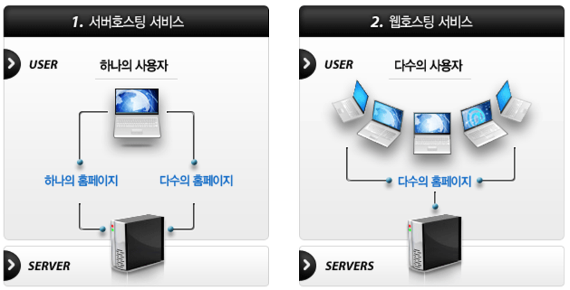
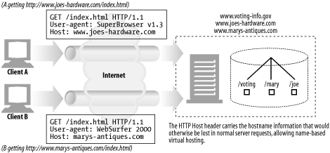
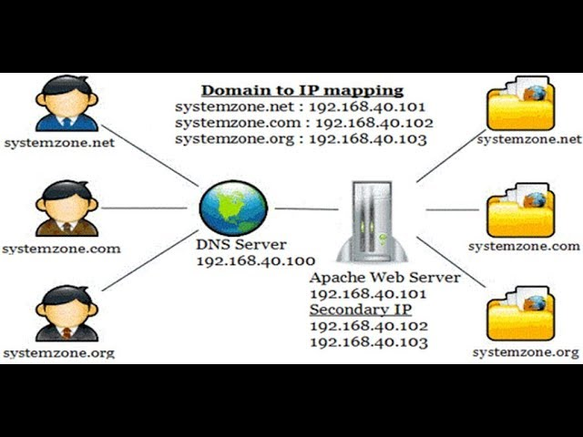
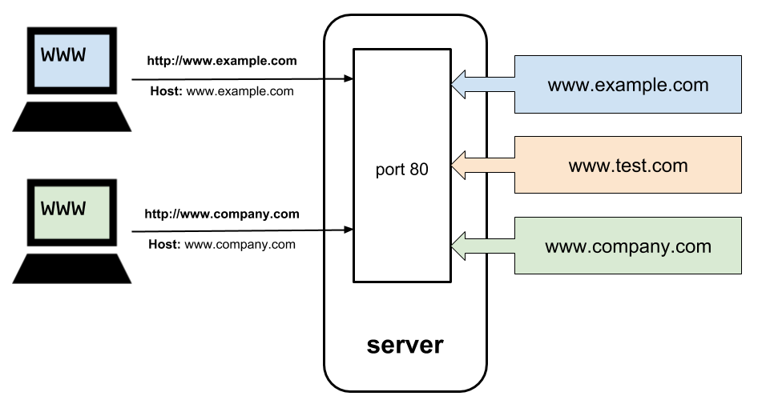

# Chapter 18. 웹 호스팅

# 1.웹 호스팅이란

콘텐츠 리소스를 저장, 중개, 관리하는 일을 통틀어 웹 호스티이라고 한다. 콘텐츠를 저장해서 제공하고 관련 로그에 접근하는 일련의 작업들을 하려면 서버가 필요한데 필요한 하드웨어와 소프트웨어를 직접 구매하지 않고 호스팅 업체를 이용해 서버와 웹 사이트 관리 프로그램을 대여받고 다양한 사용 편의기능을 제공받을 수 있다.

# 2. 가상 호스팅

많은 웹 호스팅 업자는 컴퓨터 한 대를 여러 고객이 공유하게 해서 저렴한 웹 호스팅 서비스를 제공한다. 이를 공유 호스팅 혹은 가상 호스팅이라고 부른다. 각 웹 사이트는 다른 서버에서 호스팅하는 것처럼 보이겠지만, 사실은 **물리적으로 같은 서버에서 호스팅되는 것이다**. 최종 사용자의 관점에서 가상 호스팅에 있는 웹 사이트는 물리적으로 분리된 전용 서버에서 호스팅 하는 사이트와 구분할 수 없어야 한다.

## 2.1 호스트 정보가 없는 가상 서버 요청

HTTP/1.0 명세에는 공용 웹 서버가 호스팅하고 있는 가상 웹 사이트에 누가 접근하고 있는지 식별하는 기능을 제공하지 않는다. 

HTTP/1.0 요청은 요청 메시지에 URL의 경로 컴포넌트만 전송한다.
만약 http://www.ex.com/index.html을 요청하면 브라우저는 www.ex.com에 연결을 하지만 HTTP/1.0 요청은 호스트 명에 대한 별다른 언급 없이 GET / index.html 이라는 요청을 한다. 서버가 여러 개의 사이트를 가상 호스팅하고 있으면, 사용자가 어떤 가상 웹 사이트로 접근하려고 하는 것인지 아는 데 필요한 정보가 충분하지 않다.

HTTP1.0의 서로 다른 웹 사이트 두 요청이 완전히 다른 문서를 요청을 하더라도 요청 자체는 똑같이 생겼다.

HTTP/1.0 서버 요청은 호스트 명 정보를 포함하지 않는다.

## 2.2 가상 호스팅 동작하게 하기

가상 호스팅을 동작하기 위한 네 가지 기술

1. URL 경로를 통한 가상 호스팅
2. 포트번호를 통한 가상 호스팅
3. IP 주소를 통한 가상 호스팅
4. Host 헤더를 통한 가상 호스팅

### 2.2.1 URL 경로를 통한 가상 호스팅

공용 서버에 있는 각 가상 사이트에 서로 다른 URL 경로를 할당해서 각각을 강제로 구분할 수 있다.
즉 웹 사이트마다 특정 경로를 앞에 붙일 수 있다.

EX) www.ex.com/hosting1/index.html, www.ex.com/hosting2/index.html

서버에 요청이 도착하면 호스트 명 정보가 요청에 포함되어 있진 않지만 경로에 있는 정보를 통해 각각의 호스트를 구분한다.

하지만 일반적으로 URL 기반의 가상 호스팅은 거의 사용하지 않는다.

### 2.2.2 포트번호를 통한 가상 호스팅

경로 명을 변경하는 대신 웹 서버에 각각 다른 포트번호를 할당할 수 있는데 이렇게 하면 문제점은 사용자가 비표준 포트를 포함한 URL를 요청하기에 불편함이 있다.

### 2.2.3 IP 주소를 통한 가상 호스팅

IP 주소에 대한 접근 방식은 가상 IP를 할당하는 것이다. 이 방식은 각 가상 웹 사이트에 유일한 IP 주소를 한 개 이상 부여한다. 모든 가상 서버의 IP 주소는 같은 공용서버에 연결되어 있다. 서버는 HTTP 커넥션의 목적지 IP 주소를 보고 클라이언트가 어떤 웹 사이트에 연결하려고 하는지 알 수 있다.

가상 IP 호스팅은 잘 동작하지만 몇 가지 문제가 있다.

1. 일반적으로 컨퓨터 시스템이 연결할 수 있는 장비의 IP의 갯수에는 제한이 있다.
2. IP 주소는 한정적이다. 가상 사이트를 많이 가지고 있는 호스팅 업자는 호스팅 하는 모든 웹 사이트에 할당할 가상 IP 주소를 충분히 얻지 못할 수도 있다.
3. IP 주소가 부족한 문제는 호스팅 업자가 용량을 늘리려고 서버를 복제하면서 더 심각해진다. 부하 균형의 구조상 각 복제된 서버에 IP 주소를 부여해야 하므로 IP 주소는 복제 서버의 갯수만큼 더 필요하게 된다.

### 2.2.4 Host 헤더를 통한 가상 호스팅

HTTP 요청 메시지에 Host 헤더를 확장해서 어떤 호스트에 요청하는지 구분할 수 있다.

Host 헤더 문법과 사용 방법

- Host 헤더에 포트가 기술되어 있지 않으면, 해당 스킴의 기본 포트를 사용한다.
- URL에 IP 주소가 있으면 Host 헤더는 같은 주소를 포함해야 한다.
- URL에 호스트 명이 기술되어 있으면 Host 헤더는 같은 호스트 명을 포함해야 한다.
- URL에 호스트 명이 기술되어 있으면, Host 헤더는 URL의 호스트 명이 가리키는 IP 주소를 포함해서는 안 된다.
- 클라이언트가 특정 프록시 서버를 사용한다면 Host 헤더에 프록시 서버가 아닌 원 서버의 호스트 명과 포트를 기술해야 한다.
- 웹 클라이언트는 모든 요청 메시지에 Host 헤더를 기술해야 한다.
- 웹 프록시는 요청을 전달하기 전에 요청 메시지에 Host 헤더를 추가해야 한다.
- HTTP/1.1 웹 서버는 Host 헤더 필드가 없는 HTTP/1.1 요청 메시지를 받으면 400 상태 코드로 응답해야 한다.

# 3. 미러링 된 서버 팜

서버 팜은 서로 대신할 수 있고 식벽할 수 있게 설정된 웹 서버들의 **집합**이다. 서버 팜의 서버에 있는 콘텐츠들은 한 곳에 문제가 생기면 다른 한 곳에서 대신 전달할 수 있게 미러링 할 수 있다.

미러링 된 서버는 계층적인 관계에 있다. 원본 콘텐츠를 가지고 있는 서버는 ‘콘텐츠의 원본 제작자’ 같이 행동한다. 이 서버를 마스터 원 서버라고 부른다. 마스터 원 서버로부터 콘텐츠를 받은 미러링 된 서버는 복제 원 서버라 부른다. 서버 팜에 배포하는 방법 하나는 네트워크 스위치를 사용해서 서버에 분산 요청을 보내는 것이다. **서버에 호스팅 되고 있는 각 웹 사이트 IP 주소는 스위치의 IP 주소가 된다**.

미러링 된 서버 기준으로 클라이언트의 요청이 특정 서버로 가는 두 가지 방법이 있다.

1. HTTP 리다이렉션 : 콘텐츠에 대한 URL은 마스터 서버의 IP를 가리키고 마스터 서버는 요청을 받는 즉시 복제 서버로 리다이렉트시킨다.
2. DNS 리다이렉션 : 콘텐츠의 URL은 네 개의 IP 주소를 가리킬 수 있고 DNS 서버는 클라이언트에게 전송할 IP 주소를 선택할 수 있다.

## 3.1 콘텐츠 분산 네트워크

콘텐츠 분산 네트워크(CDN)는 특정 콘텐츠의 분산을 목적으로 하는 단순한 네크워크다. 네트워크의 노드는 서버, 대리 서버, 혹은 프록시 서버가 될 수 있다.

### 3.1.1 CDN의 대리 캐시

대리 캐시는 복제 원 서버를 대신해 사용될 수 있다.

리버스 프록시라고도 불리는 대리 서버는 미러링 된 웹 서버처럼 콘텐츠에 대한 요청을 받는다.
그들은 **특정 원 서버 집합을 대신해 요청을 받는다**(이는 콘텐츠에 대한 **IP 주소가 알려졌기 때문**에 가능하다. 보통 원 서버와 대리 서버가 연결되며, 대리 서버는 특정 원 서버를 가리키는 요청을 받는다).

대리 서버와 미러링 된 서버의 차이점은 대리 서버는 보통 수요에 따라 동작한다. **대리 서버는 원 서버의 전체 콘텐츠를 복사하지는 않는다**. 클라이언트가 요청하는 콘텐츠만 저장할 뿐이다. 대리 서버의 캐시에 콘텐츠가 분산되는 방식은 그들이 받는 요청에 따라 달라진다. 원 서버는 그들의 콘텐츠를 업데이트 해줄 의무는 없다. 많은 요청이 있는 콘텐츠를 빠르게 제공하려고 사용자가 요청하기도 전에 콘텐츠를 가져오는 ‘미리 가져오기’ 기능을 가진 대리 서버도 있다.

### 3.1.2 CDN의 프록시 캐시

대리 서버와는 다르게 전통적인 프록시 캐시는 어떤 웹 서버 요청이든지 다 받을 수 있다(프록시 캐시와 원 서버 간의 연동이나 IP 주소 합의가 필요 없다). 하지만 대리 서버를 사용하면 프록시 캐시의 콘텐츠는 요청이 있을 때만 저장될 것이고 원본 서버 콘텐츠를 정확히 복제한다는 보장이 없다. 어떤 프록시는 요청을 많이 받는 콘텐츠를 미리 로딩하기도 한다.

요청이 있을 때만 저장하는 프록시 캐시는 조금 다른 방식으로 동작하는데 스위치 혹은 라우터가 중간에서 웹 트래픽을 가로채 처리하기도 한다.