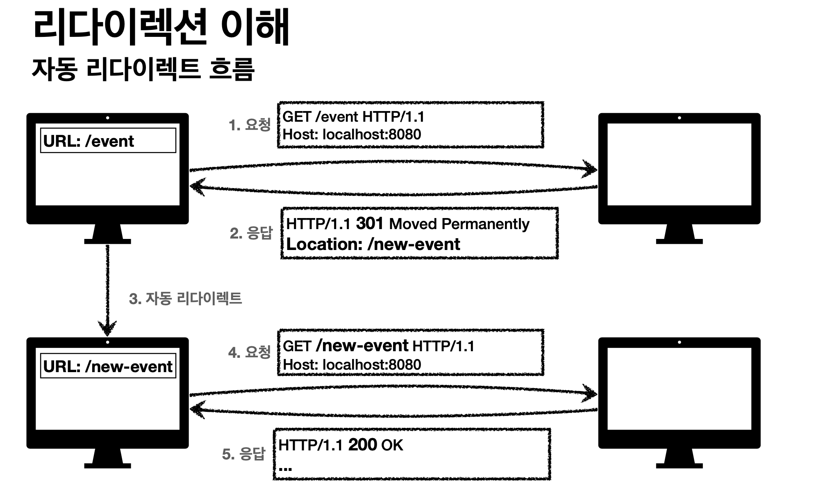

# Chapter 20. 리다이렉션과 부하 균형

리다이렉션 기술은 보통 메시지가 프록시, 캐시, 특정 웹 서버 중 어디에서 끝나는지 판별하기 위해 사용한다. 리다이렉션 기술은 클라이언트의 메시지를 명시적으로 요청하지 않은 곳으로 보낼 수 있다. 라다이렉션이란 최적의 분산된 콘텐츠를 찾는 것을 도와주는 기법의 집합이라고 할 수 있다.

# 1. 리다이렉션이 필요한 이유

- 신뢰할 수 있는 HTTP 트랜잭션의 수행
- 지연 최소화
- 네트워크 대역폭 절약

이러한 이유들 때문에 웹 콘텐츠는 흔히 여러 장소에 배포한다. 이렇게 하면 한 곳에서 실패한 경우 다른 곳을 이용할 수 잇기에 신뢰성이 개선된다. 또한 클라이언트가 보다 가까운 리소스에 접근할 수 있게 되어 콘텐츠를 더 빨리 받게 되므로 응답시간도 줄여준다. 그리고 목적지 서버가 분산되므로 네트워크 혼잡도가 줄어든다.

# 2. 리다이렉트 할 곳

서버, 프록시, 캐시, 게이트웨이는 클라이언트가 그들에게 HTTP 요청을 보내고 그들이 그것을 처리한다는 관점에서 보면 클라이언트에게 있어 모두 서버라고 할 수 있다. 서버, 프록시, 캐시, 게이트웨이가 모두 공통적으로 서버의 특성을 갖고 있기 때문에, 많은 리다이렉션 기법이 그들 모두에게 동작한다.

웹 서버는 IP별로 요청을 다룬다. **똑같이 복제된 서버들로 요청을 분산한다는 것은 같은 URL에 대해 여러 곳에서 온 요청들을 각각 최적의 웹 서버로 보내겠다는 것을 의미한다**.

프록시는 프로토콜별로 요청을 다룬다. 클라이언트 근처에 프록시 캐시가 있다면 모든 요청이 프록시 캐시로 흘러 들어가는 것이 이상적이다. 왜냐하면 캐시는 자주 찾는 문서를 저장하여 클라이언트에게 직접 제공하기 때문이다. 프록시로의 리다이렉트는 주 진입로의 트래픽을 근처에 있는 지름길로 빨아들이는 것과 같다.

# 3.리다이렉션 프로토콜의 개요

리다이렉션의 목표는 HTTP 메시지를 가용한 웹 서버로 가급적 빨리 보내는 것이다.

리다이렉션 방법에는 메시지를 서버로 리다이렉트하기 위해 사용되는 일반 리다이렉션 방법과 
프록시와 캐시 리다이렉션 방법으로 구분할 수 있다.

# 4. 일반적인 리다이렉션 방법

## 4.1 HTTP 리다이렉션

**웹 서버들은 다른 곳에 요청을 보내보라고 말해주는 짧은 리다이렉트 메시지를 클라이언트에게 돌려줄 수 있다**. 몇몇 웹 사이트는 HTTP 리다이렉션을 이용해 간단하게 부하를 분산한다. 요청을 처리하는 서버(리다이렉팅 서버)는 가용한 것들 중 부하가 가장 적은 콘텐츠 서버를 찾아서 브라우저의 요청을 그 서버로 리다이렉트한다. 다른 형태의 리다이렉션에 비해 HTTP 리다이렉션이 갖는 장점 중 하나는 리다이렉트를 하는 서버가 클라이언트의 아이피 주소를 안다는 것이다.

HTTP 리다이렉션의 단점

1. 어떤 서버로 리다이렉트 할 지 결정하려면 원 서버는 상당히 많은 처리를 해야 한다.
2. 페이지를 접근할 때마다 두 번의 왕복이 필요하기 때문에, 사용자가 더 오래 기다리게 된다.
3. 리다이렉트 서버가 고장 나면 사이트도 고장 난다.

이러한 약점들 때문에 HTTP 리다이렉션은 보통 몇몇 다른 리다이렉션 기법과 함께 조합하여 사용된다.

## 4.2 DNS 리다이렉션

클라이언트가 어떤 웹 서버의 사이트에 접근하려고 시도할 때마다 도메인 이름(www.example.com)은 반드시 아이피 주소로 분석되어야 한다. DNS 분석자는 클라이언트의 운영체제일 수도 있고, 클라이언트의 네트워크에 있는 DNS 서버이거나 혹은 더 원격에 있는 DNS 서버일 수도 있다. DNS는 하나의 도메인에 여러 아이피 주소가 결부되는 것을 허용하며 DNS 분석자는 여러 아이피 주소를 반환하도록 설정하거나 프로그래밍 될 수 있다. 분석자가 어떤 아이피 주소를 반환할 것인가를 결정하는 방법은 단순한 것(라운드 로빈)부터 복잡한 것(여러 서버의 로드를 검사해서 로드가 가장 적은 서버의 아이피 주소를 반환하는 것)까지 다양하다.

### 4.2.1 DNS 라운드 로빈

DNS 라운드 로빈은 가장 흔한 동시에 가장 단순한 리다이렉션 기법이다. DNS 라운드 로빈은 웹 서버 팜 전체에 대한 부하의 균형을 유지하기 위해 DNS 호스트 명 분석 기능을 사용한다. 순수한 부하 균형 전략이며, 서버에 대한 클라이언트의 상대적인 위치나 서버의 현재 스트레스를 고려하지 않는다.

### 4.2.2 다중 주소와 라운드 로빈 주소 순환

대부분의 DNS 클라이언트는 그냥 다중 주소 집합의 첫 번째 주소를 사용한다. 부하 균형을 위해 대부분의 DNS 서버는 룩업이 끝났을 때마다 주소를 순환시킨다. 이 주소 순환을 DNS 라운드 로빈이라고 한다. 그러나 이 부하 균형은 완벽하지 않다. DNS 룩업의 결과는 애플리케이션, 운영체제, 몇몇 기초적인 자식 DNS 서버에 의해 기억되어 재사용될 수 있기 때문이다. 이러한 이유로 DNS 라운드 로빈은 일반적으로 하나의 클라이언트로 인한 부하를 제대로 분산하지 못한다.

## 4.3 향상된 다른 DNS 기반 리다이렉션 알고리즘

1. 부하 균형 알고리즘
    1. 몇몇 DNS 서버는 웹 서버의 로드를 추적하고 가장 로드가 적은 웹 서버를 목록의 가장 위에 놓는다.
2. 근접 라우팅 알고리즘
    1. 웹 서버들의 팜이 지리적으로 분산되어 있는 경우, DNS 서버는 사용자를 근처의 웹 서버로 보내는 시도를 할 수 있다. 이 모델의 단점 중 하나는 DNS 서버가 결정을 내리기 위해 사용하는 **유일한 정보가 클라이언트의 아이피 주소가 아닌 로컬 DNS 서버의 아이피 주소**라는 것이다.
3. 결함 마스킹 알고리즘
    1. DNS 서버는 네트워크 건강 상태를 모니터링하고 요청을 정전이나 기타 장애를 피해서 라우팅 할 수 있다.

## 4.4 임의 캐스트 어드레싱

흩어진 웹 서버들은 정확히 같은 아이피 주소를 갖고 클라이언트의 요청을 클라이언트에서 가장 가까운 서버로 보내주기 위해 백본 라우터의 ‘최단거리’ 라우팅 능력에 의지한다.

## 4.5 아이피 맥 포워딩

HTTP 메시지는 주소가 붙은 데이터 패킷을 형태로 보내진다. 각 패킷은 출발지와 목적지의 아이피 주소와 TCP 포트 번호를 갖는데 스위치나 라우터 같은 네트워크 요소가 패킷의 목적지 주소를 읽었을 때 패킷이 리다이렉트 되어야 한다면 스위치는 그 패킷에게 서버나 프록시의 목적지 MAC 주소를 준다.

## 4.6 아이피 주소 포워딩

스위치나 다른 레이어 4를 이해하는 장비는 패킷의 목적지 포트를 평가하고 리다이렉트 패킷의 아이피 주소를 프록시나 미러링 된 서버의 아이피 주소로 바꾼다.

이러한 종류의 전달은 네트워크 주소 변환(Network Address Translation, NAT)이라고도 불린다.

# 5. 프록시 리다이렉션 방법

콘텐츠에 접근할 때 프록시를 통할 필요가 있는 경우도 있으며 클라이언트가 이용하면 유익한 프록시 캐시가 네트워크에 있을 수도 있다(캐시된 콘텐츠를 받는 것이 원 서버에 직접 가는 것보다 빠르기 때문이다).

프록시는 결과적으로 클라이언트의 요청을 다른 프록시로 리다이렉트할 수 있다. 예를 들어 요청 받은 콘텐츠를 갖고 있지 않은 프록시 캐시는 클라이언트를 다른 캐시로 리다이렉트하도록 할 수 있다.

## 5.1 명시적 브라우저 설정

대부분의 브라우저에는 프록시 서버에 접촉하기 위해 프록시 이름, 아이피 주소, 포트번호를 설정할 수 있는 메뉴가 존재한다. 사용자가 이를 설정하면 브라우저는 모든 요청에 대해 프록시와 접촉한다.

단점

- 만약 프록시가 다운되었거나 브라우저가 잘못 설정되었다면, 사용자는 접속 문제에 마주하게 된다.
- 네트워크 아키텍처를 변경했을 때 그 변경사항을 모든 최종사용자에게 전파하는것이 어렵다.

## 5.2 프록시 자동 설정

올바른 프록시 서버에 접촉하기 위해 브라우저가 동적으로 설정할 수 있게 하는 자동 설정 방법이 있다. 이 방법을 프록시 자동설정(PAC)프로토콜이라고 불린다.

PAC는 브라우저들이 URL별로 접촉해야 할 프록시를 지정한 PAC 파일이라 불리는 특별한 파일을 찾도록 하는것이다. 브라우저는 반드시 PAC파일을 얻기 위해 지정된 서버에 접촉하도록 설정되어야 한다. 브라우저는 재시작 할 때마다 PAC 파일을 가져온다.
PAC 파일은 다음의 함수를 반드시 정의해야하는 `자바스크립트` 파일이다.

<aside>
💡 function FindProxyForURL(url, host)

</aside>

## 5.3 웹 프록시 자동발견 프로토콜

웹브라우저가 근처의 프락시를 찾아내어 사용할 수 있게 해주는 방법을 제공해 준다.

# 6. 캐시 리다이렉션 방법

## 6.1 WCCP 리다이렉션

- 캐시 조직 프로토콜(WCCP)는 라우터들과 캐시들 사이의 대화를 관리하여 라우터가 캐시를 검사하고, 특정 종류의 트래픽을 특정 캐시로 보낼 수 있게 해준다.
- WCCP 서비스 그룹을 구성하고, 어떤 트래픽이 어디로 어떻게 보내지는지, 서비스 그룹에서 부하가 캐시들 사이에서 어떻게 분산되어야 하는지 명시한다.
- HTTP 요청이 서비스 그룹의 라우터에 도착한다면, 라우터는 그 요청을 처리하기 위해 서비스 그룹의 캐시 중 하나를 선택한다.

# 7. 인터넷 캐시 프로토콜

인터넷 캐시 프로토콜(ICP)는 캐시들이 형제 캐시에게 일어난 캐시 적중을 찾아볼 수 있도록 해준다. 만약 캐시가 HTTP 메시지에서 요청한 콘텐츠를 갖고 있지 않다면 캐시는 근처 형제 캐시 중 그 콘텐츠를 갖고 있는 것이 있는지 찾아보고 만약 있다면 원 서버에 질의하는 것보다 비용이 더 들지 않을 것을 기대하며 그 캐시에서 콘텐츠를 가져온다. ICP는 일종의 캐시 클러스터링 프로토콜이라고 할 수 있다.

ICP는 객체 발견 프로토콜이다. 캐시는 이 프로토콜을 사용해 근처의 캐시 모두에게 특정 URL을 갖고 있는지 **한번에** 물어본다. 근처의 캐시들은 그 URL을 갖고 있다면 ‘HIT’, 아니라면 ‘MISS’라고 메시지를 보낸다. 그러면 물어본 캐시는 그 객체(URL)를 갖고 있는 이웃 캐시에 대한 HTTP 커넥션을 열 수 있다.

# 8. 캐시 배열 라우팅 프로토콜

캐시 배열 라우팅 프로토콜(CARP)은 프록시 서버의 배열이 클라이언트 시점에서는 마치 하나의 논리적인 캐시처럼 보이도록 관리해주는 표준이다.

CARP는 ICP의 대안이다.

각 구성요소 서버가 전체 캐시된 문서의 일부만 갖고 있는 하나의 큰 서버처럼 동작한다.
하나의 웹 객체는 하나의 프락시 서버에만 속하기 때문에, 프락시 서버 각각을 폴링하지 않고도 한 번의 검색으로 그 객체의 위치를 결정할 수 있다.

# 9. 하이퍼텍스트 캐싱 프로토콜

하이퍼텍스트 캐싱 프로토콜(HTCP)은 형제 프록시 서버들이 **URL과 모든 요청 및 응답 헤더를 사용**하여 서로에게 문서의 존재 여부에 대한 질의를 할 수 있도록 해줌으로써 잘못 처리될 확률을 줄인다.

HTCP는 형제 캐시들이 서로의 캐시 안에 있는 선택된 문서의 추가 및 삭제를 모니터링하고 요청할 수 있게 해주고 또한 서로의 캐시된 문서에 대한 캐싱정책을 변경할 수 있게 해준다.