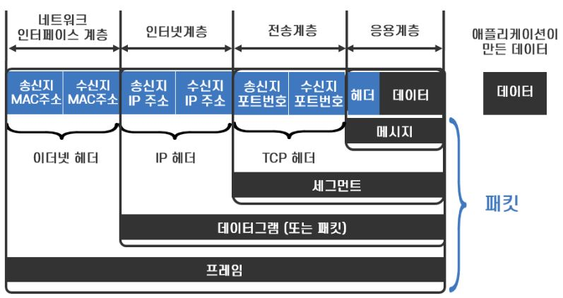
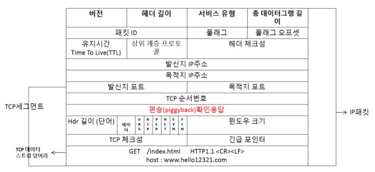
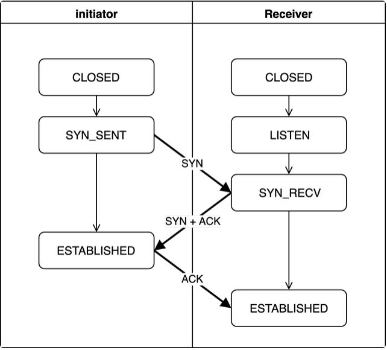
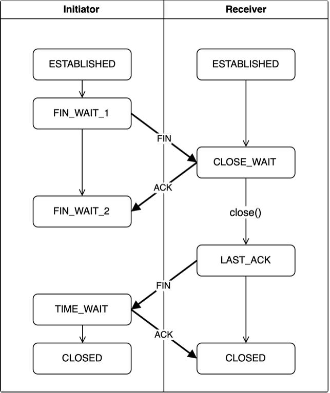
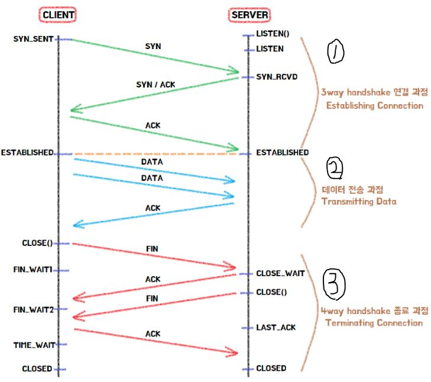
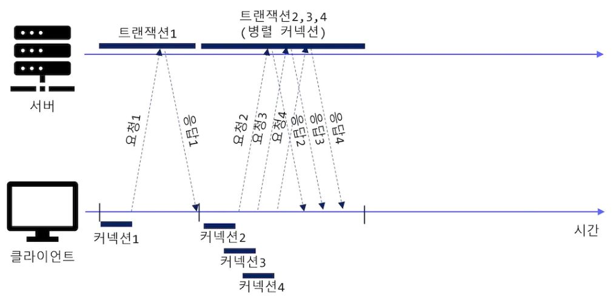
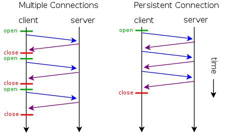
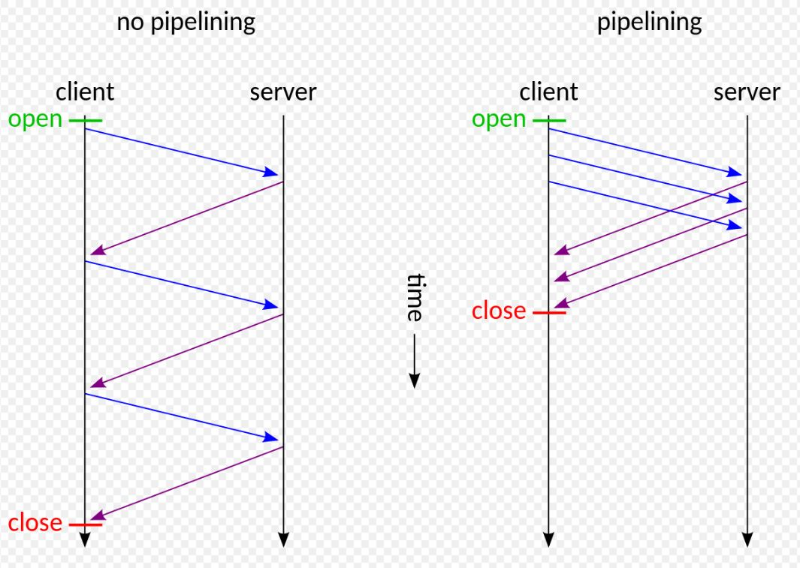

# Chapter 4. 커넥션 관리

# 1. TCP 커녁션

기본적으로 클라이언트와 서버가 HTTP통신을 하려면 그 전에  TCP Connection(연결)이 되어야 합니다. 커넥션이 맺어지면 서로 간에 주고받는 메시지들은 손상되거나 순서가 바뀌지 않고 안전하게 전달된다.

TCP 커넥션은 발신지(클라이언트)의 IP와 Port, 수신지(서버)의 IP와 Port 이렇게 4가지 값으로 식별합니다.

<aside>
💡 `**<발신지 IP 주소, 발신지 Port, 수신지 IP 주소, 수신지 Port>**`

</aside>

## 1-1. 데이터 통신을 하기 위한 패킷 교환 방식과 TCP/IP 데이터 단위

패킷 전송 방식의 패킷은 데이터를 효율적으로 전송하기 위해 **데이터를 작은 조각으로 분할**하고 분할된 조각에 헤더를 붙여 캡슐화 데이터를 의미합니다. 그리고 이 패킷을 라우터가 라우팅을 통해 송신 호스트에서 수신 호스트까지 전송하는 것이 패킷 교환 방식입니다.

*1 TCP헤더에선 세그먼트라는 단위로 데이터 스트림을 나눈다.

*2 IP헤더에선 세그먼트를 IP패킷에 담는다.

IP패킷(데이터 단위) 상세구조

## 1-1. HTTP통신 전, 후 논리적인 TCP연결

TCP/IP프로토콜을 활용해 HTTP 통신 요청을 하기 위해서는 요청 전 논리적인 TCP연결(**커넥션 확립**)이 필요합니다.

논리적인 TCP 커넥션 확립이란, 애플리케이션 간의 송수신을 하는 데이터 통로를 의미하며 실제 케이블로 연결된 개념이 아닌 가상의 통신로를 의미합니다.

## 1-2. 3 Way-Handshake

TCP 커넥션 확립을 하기 위해 연결을 생성할 때 거치는 핸드쉐이크 과정을 3 Way-Handshake라고 합니다. 3 Way라는 말 그대로 총 3번의 통신 과정을 거칩니다.

## 1-3. 4 Way-Handshake

연결을 생성할 때와 마찬가지로, 연결을 종료할 때도 4 Way-Handshake과정을 거쳐 연결을 종료합니다. 한 쪽에서 일방적으로 연결을 끝어버리면 다른 한 쪽은 연결이 끊어졌는지 지속되고 있는지 알 방법이 없다. 또한 연결을 종료하기 전 처리하지 못한 데이터가 있을 수 있기 때문에 양방향 다 정상적으로 연결을 종료할 준비가 되었는 지를 확인하기 위해 4 Way-Handshake과정이 필요하다.

## 1-4. 논리적인 연결을 포함한 모든 통신과정

① : 1-2참조

② : 1-1참조

③ : 1-3참조

*tcp연결 상세정보 : [https://evan-moon.github.io/2019/11/17/tcp-handshake/](https://evan-moon.github.io/2019/11/17/tcp-handshake/)

---

# 2. TCP커넥션의 성능 향상 기술

기본적으로 HTTP통신는 TCP 프로토콜 기반으로 동작합니다. TCP가 전송이 끝나면 앞 사진의 내용처럼 연결이 끊어지듯이 HTTP도 전송이 끝나면 끊어집니다(비연결성). 매번 똑같은 주소로 요청을 할 때마다 새로운 연결을 설정하고 끊어야 한다면 자원이 낭비됩니다.
그래서 연결을 

여러 개의 요청 있을 경우 순차적으로 각 요청에 대해 1-4 그림처럼 진행하게 된다면 많은 자원(resource)이 낭비하게 된다. 이런 단점을 보완하게 위해 나온 기술이 있다.

1. **병렬 커넥션**

병렬 커넥션은 클라이언트가 **여러 개의 커넥션을 맺음**으로써 여러 개의 **HTTP 트랜잭션을 병렬로 처리할 수 있게 하는 방법**입니다. 위의 사진에서는 **트랜잭션2, 3, 4이 할당받은 각 TCP 커넥션상의 트랜잭션**을 통해 병렬로 내려받습니다.

- ****병렬 커넥션은 페이지를 더 빠르게 내려받는다****
    - 단일 커넥션의 대역폭 제한과 커넥션이 동작하지 않고 있는 시간을 활용하면, 객체가 여러 개 있는 웹페이지를 더 빠르게 내려받을 수 있습니다. 각 커넥션의 지연 시간을 겹치게 하면 총 지연 시간을 줄일 수 있고, 클라이언트의 인터넷 대역폭을 한 개의 커넥션이 다 써버리는 것이 아니라면 나머지 객체를 나려받는 데에 남은 대역폭을 사용할 수 있습니다.
- ****병렬 커넥션이 항상 더 빠르지는 않다****
    - 병렬 커넥션이 일반적으로 더 빠르기는 하지만, 항상 그렇지는 않습니다. 클라이언트의 네트워크 대역폭이 좁을 때는 대부분 시간을 데이터를 전송하는 데에만 쓸 것입니다. 여러 개의 객체를 병렬로 내려받는 경우, 제한된 대역폭 내에서 각 객체를 전송받는 것은 느리기 때문에 성능상의 장점은 거의 없어집니다.
- ****병렬 커넥션은 더 빠르게 "느껴질 수" 있습니다****
    - 결과적으로 모든 내용이 다 로드되기까지의 시간이 더 걸러더라도, 화면의 내용이 한 번에 로드되는 것을 더 빠르다고 느낍니다. 따라서 병렬 커넥션이 페이지를 더 빠르게 내려받는 것은 아니지만, 화면에 여러 개의 객체가 동시에 보이면서 내려받고 있는 상황을 볼 수 있기 때문에 사용자는 더 빠르게 내려받고 있는 것처럼 느낄 수 있습니다.

1. **지속 커넥션**

처리가 완료된 후에도 계속 연결된 상태로 있는 TCP 커넥션을 지속 커넥션이라고 한다.
비지속(단일) 커넥션은 각 처리가 끝날 때마다 커넥션을 끊지만, 지속 커넥션은 클라이언트나 서버가 커넥션을 끊기 전까지는 트랜잭션 간에도 커넥션을 유지한다.

HTTP 1.0 기반에서는 각각의 웹컨텐츠별로 TCP 커넥션이 모두 필요했다.
과거 웹페이지가 텍스트 기반 아래 간단한 형태였을 때는 크게 문제가 되지 않았으나, 점점 어플리케이션이 복잡하고 화려해지면서 성능에 문제가 되기 시작했다.
ex) 하나의 HTML과 그 안에 CSS가 10개가 있을 경우 11번의 TCP커넥션이 필요했음

**HTTP 1.0 기반에서** 지속 커넥션을 사용하기 위해선 클라이언트 측에서 요청을 할 때
Connection: Keep-Alive 헤더를 포함시킨다. 요청을 받은 서버는 지속 커넥션을 받고자 한다면, 응답헤더에 같은 헤더를 포함시키고 또한, **Keep-Alive헤더와 최대시간(timeout), 최대 요청(max request)의 수를 알려줘야 합니다.**

**그러나 HTTP/1.1부터는 지속 커넥션이 기본값이기에 "Connection: keep-alive"가 불필요한 경우가 많습니다.**

### Connection: keep-Alive의 주의점

- "**Connection: keep-alive" 헤더가 초기HTTP 요청 또는 응답에 사용되는 경우에는 기존처럼 3 Way-Handshake를 초기 연결 설정 중에 한 번만 수행하고 그 이후의 후속 요청들에 대해선 3 Way-Handshake를 수행할 필요 없이 여러 HTTP 트랜잭션에 대해 TCP 연결을 열어 둡니다.**

- **HTTP 1.1 부터는 기본적으로 요청에 대한 연결을 일정시간동안 끊지않도록 되어있기 때문에 keep-alive 헤더를 사용할 필요가 없다.**

1. **파이프라인 커넥션**

- HTTP 파이프라이닝은 **HTTP/1.1의 기능**으로, 해당 응답을 기다릴 필요 없이 단일 TCP 연결을 통해 여러 HTTP 요청을 전송할 수 있습니다.
- • HTTP 클라이언트는 커넥션이 지속 커넥션인지 확인하기 전까지는 파이프라인을 이어서는 안됩니다.
- • HTTP 응답은 요청 순서와 같게 와야 합니다. HTTP 메시지는 순번이 있지 않기 때문에, 응답이 순서 없이 오면 순서에 맞게 정렬시킬 수 없습니다.
- 모든 종류의 HTTP 요청이 파이프라인으로 처리될 수 있는 것은 아닙니다: GET, HEAD, PUT 그리고 DELETE 메서드같은 멱등성(idempotent) 메서드만 가능합니다. 실패가 발생한 경우에는 단순히 파이프라인 컨텐츠를 다시 반복하면 됩니다.
- HTTP 클라이언트는 POST 요청과 같은 **멱등성(idempotent)이 보장되지 않는 요청**은 파이프라인을 통해 보내면 안됩니다. 왜냐하면 에러가 발생하면 파이프라인을 통한 요청 중에 어떤 것들이 서버에서 처리되었는지 클라이언트는 알 수 없기 때문입니다.
- **레거시 HTTP/1.1 서버는 파이프라이닝을 올바르게 지원하지 않아 대부분의 HTTP 클라이언트가 HTTP 파이프라이닝을 사용하지 않습니다.**
- **이 기술은 대부분의 최신 브라우저에서 지원되는 HTTP/2를 통한 멀티플렉싱으로 대체되었습니다**