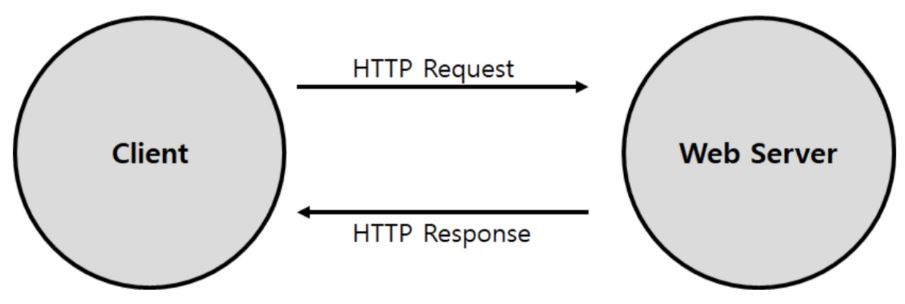

# Chapter 5. 웹서버

# 1. 웹 서버란.

- 소프트웨어 측면 : 소프트웨어 측면 : 웹서버는 HTTP와 같은 프로토콜을 통해 넘어온 클라이언트의 요청에 HTML과 같은 웹 페이지로 응답하는 소프트웨어다. 대표적인 예로 nginx, apache가 있다. 이 소프트웨어들은 호스팅하고 있는 서버(컴퓨터)에서 웹페이지의 컴포넌트 파일들(html, image, css, javacript 등)에 어떻게 접근하는지를 관리한다.
- 하드웨어측면 : nginx나 apache와 같은 소프트웨어가 실제로 동작하고, 웹 페이지의 데이터를 실제로 저장하는 서버(컴퓨터)를 의미한다. 웹 서버는 인터넷에 연결되어 IP주소로 식별되고, 이 주소를 통해 클라이언트와 연결된다.

# 2. 웹 서버의 기본 작업

1. 클라이언트 커넥션 수락(커넥션 연결)

- 클라이언트가 이미 서버에 대해 지속적 커넥션을 갖고 있다면 그 커넥션을 사용할 수 있다.
- 웹 서버는 클라이언트 IP 주소나 호스트 명이 인가되지 않았거나 악의적이라고 알려진 것인 경우 커넥션을 닫을 수 있다.
- 웹 서버는 역방향 DNS(reverse DNS)를 사용해 클라이언트의 IP 주소를 호스트 명으로 변환할 수 있다. 하지만 시간이 많이 걸릴 수 있으므로 그 기능을 꺼두거나 특청 콘텐츠에 대해서만 가능하도록 해 놓는다.
- 최근엔 리버스 조회는 일반적으로 이메일 서버에서 사용됩니다.

                      ↓

1. 요청 메시지 수신(요청 받음)

- 커넥션에 데이터가 도착하면 웹 서버는 네트워크 커넥션에서 그 데이터를 읽어 들이고 파싱하여 요청 메시지를 구성한다.
    - 요청줄을 파싱하여 요청 메서드(ex.GET, POST), 지정된 리소스의 식별자(URL),
    버전 번호(ex. HTTP/1.0, HTTP/1.1)를 찾는다. 각 값은 스페이스 한 개로 분리되어 있고
    요청줄은 캐리지 리턴 줄바꿈(CRLF) 문자열로 끝난다.
- 2.1. 웹 서버들은 요청이 언제라도 도착할 수 있기에 항상 새 요청을 주시하고 있다. 웹 서버 아키텍처의 차이에 따라 요청을 처리하는 방식이 달라진다.
    
    
    1. 싱글 스레드 웹 서버(Single Thread Web Server)
    2. 멀티프로세스/멀티스레드 웹 서버
    3. 다중 I/O 서버
    4. 다중 멀티스레드 웹 서버

                           ↓

1. 요청 처리(요청 메시지 해석)
    - 요청을 받으면, 서버는 요청으로부터 메소드, 리소스, 헤더, 본문(GET메소드 경우 생략)
    을 얻어 처리한다.
    - POST를 비롯한 몇몇 메서드는 요청 메시지에 엔터티 본문이 있을 것을 요구한다.
    - GET과 같이 요청 메시지에 엔터티 본문이 있는 것을 금지하는 메소드도 있다.

                           ↓

1. 리소스의 매핑과 접근(메시지에 시정한 리소스 접근)
    - 웹 서버가 클라이언트에 콘텐츠를 전달하려면, 그전에 요청 메시지의 URL에 대응하는 알맞은 콘텐츠나 콘텐츠 생성기를 웹 서버에서 찾아서 그 콘텐츠의 원천을 식별해야 한다.

                           ↓

1. 응답 만들기(HTTP 응답 메시지 생성)
    - 서버가 리소스를 식별하면 서버는 요청 메서드로 서술되는 동작을 수행한 뒤 응답 메시지를 반환한다.
    - 응답 메시지는 응답 상태 코드(ex. 200, 404), 응답 헤더, 응답 본문(본문이 있을 경우)을 포함.
    - 본문이 생성되었다면 **MIME타입을 서술하는 Content-Type헤더, 본문 길이를 서술하는
    Content-Length와 본문의 내용을 포함**해야한다.
    
                        ↓
    
2. 응답 보내기(클라이언트에게 전달)

                          ↓

1. 로깅(트랜잭션에 대한 기록을 저장)
    - 클라이언트와 트랜잭션이 완료되었을 때 웹 서버는 트랜잭션이 어떻게 수행되었는지에 대한 로그를 로그파일에 기록한다.