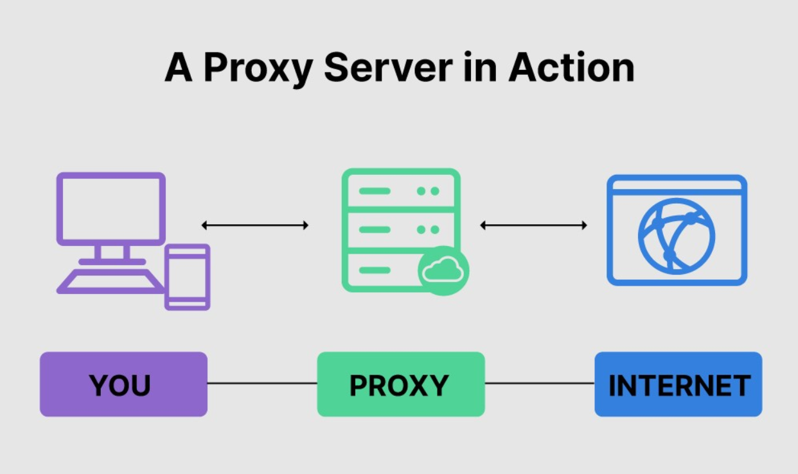
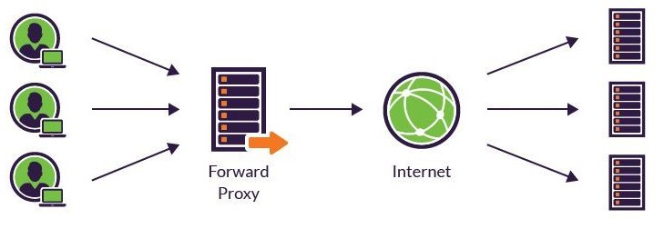
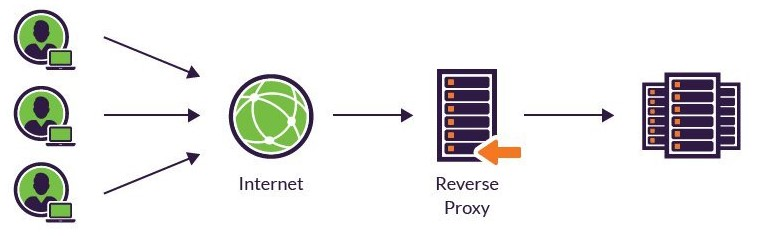
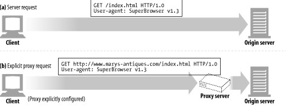
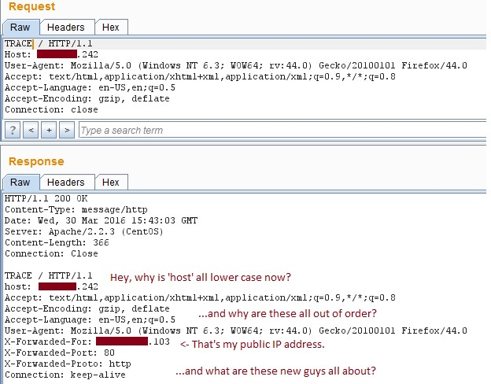

# Chapter 6. 프록시(proxy)

# 1. 프록시란?

프록시란 클라이언트와 서버 사이에 위치하여 그들 사이의 HTTP 메시지를 정리하는 중애인이다. 즉,
클라이언트에서 서버로 접속을 할 때 직접적으로 접속하지 않고 중간에 대신 전달해주는 서버를 의미한다.

프록시 서버는 웹 서버이기도 하고 웹 클라이언트이기도 한다. 프록시는 클라이언트 요청을 받고 반드시 웹 서버처럼 요청과 커넥션을 다루고 응답을 돌려줘야 한다. 동시에 요청을 서버로 보내기도 하므로, 요청을 보내고 응답을 받는 클라이언트처럼 동작해야 한다.

## 1-1. 프록시 서버를 이용한 데이터 통신 과정

1. **클라이언트에서 프록시 서버로 전달할 요청을 보낸다.**
2. **프록시 서버는 클라이언트로부터 전달 받은 요청을 서버에 요청한다.**
3. **서버는 요청에 맞게 데이터를 프록시 서버로 전달한다.**
4. **프록시 서버는 서버로부터 전달 받은 데이터를 클라이언트에 전달한다.**

# 2. 프록시의 두 종류

## 2-1. 포워드 프록시(Forward Proxy)

포워드 프록시 서버는 위 그림처럼 **클라이언트 바로 뒤에** 놓여 있다.

클라이언트가 웹 리소스에 대한 액세스를 요청하면 대상 서버로 직접 요청하는 대신 포워드 프록시 서버로 요청을 보냅니다. 그런 다음 정방향 프록시는 요청을 대상 서버로 전달하고 응답을 수신하여 클라이언트로 다시 보냅니다. 클라이언트는 실제 서버의 신원을 인식하지 못합니다.

Forward Proxy는 내부망에서 **클라이언트와 Proxy 서버가 통신**하여 인터넷을 통해 외부에서 데이터를 가져온다.

포워드 프록시 예)

1. 클라이언트에서 www.example.com과 같은 웹사이트에 요청을 보냅니다.
2. www.example.com으로 직접 요청을 보내는 대신 클라이언트가 포워드 프록시 서버로 요청을 보냅니다.
3. 포워드 프록시 서버는 요청을 실제서버(www.example.com)에게 전달합니다.
4. 실제서버는 포워드 프록시 서버에게 응답을 다시 보냅니다.
5. 응답을 받은 포워드 프록시 서버는 이를 클라이언트에게 전달합니다.

## 2-1-1. 포워드 프록시의 장단점

### 장점

****클라이언트 보안 (Security)****

- 보통 정부, 학교, 기업 등과 같은 기관은 해당 기관에 속한 사람들의 제한적인 인터넷 사용을 위해 방화벽을 사용한다.
    
    포워드 프록시 서버는 방화벽과 같은 개념으로 제한을 위해 사용 된다고 보면 된다.
    
    즉, 해당 기관에 속한 사람들이 그들이 방문하고자 하는 웹사이트에 직접적으로(directly) 방문하는 것을 방지할 수 있다. 예를 들어, 포워드 프록시 서버에 룰을 추가해서 특정 사이트에 접속하는 것을 막을 수 있다.
    

****캐싱 (Caching)****

- 우리가 어떤 웹 페이지에 접근하면 프록시 서버는 해당 페이지 서버의 정보를 캐싱(임시보관)해둔다.
    
    그래서 똑같이 해당 페이지에 접근하거나, 다른 클라이언트가 해당 페이지를 요청할 때 , 캐시된 정보(페이지)를 그대로 반환할 수 있고, 이는 서버의 부하를 줄이는 효과도 낼 수 있다.
    
    만일 4명의 클라이언트가 www.example.com에 접근할때 본래는 각각 따로 인터넷을 경유해서 페이지를 받겠지만, 포워드 프록시를 이용하면 프록시내 캐싱 된 페이지를 불러오기 때문에 훨씬 빠르게 조회할수 있는 원리이다.
    

****암호화 (Encryption)****

- 클라이언트의 요청은 포워드 프록시 서버를 통과할 때 암호화된다.
    
    암호화된 요청은 다른 서버를 통과할 때 필요한 최소한의 정보만 갖게 되는데, 이는 클라이언트의 ip 를 (보안을 위해) 감춰주는 보안 효과를 내준다.
    
    따라서 본 서버에서 IP 주소를 역추적해도 포워드 프록시 서버를 사용하면  정체를 파악하기 어렵게 된다. 왜냐면 IP 추적해도 포워드 프록시 서버 IP만 보이기 때문이다.
    

### 단점

**단일 실패 지점**

- 포워드 프록시 서버가 다운되면 이를 사용하는 모든 사용자의 인터넷 액세스가 중단되어 가동 중지 시간이 발생할 수 있습니다.

**성능 오버헤드**

- 포워드 프록시를 사용하면 모든 요청과 응답이 이를 통과해야 하므로 성능 오버헤드가 발생할 수 있습니다. 이로 인해 특히 프록시 서버의 전력이 부족하거나 과부하된 경우 지연 시간이 발생할 수 있습니다.

## 2-2. 리버스 프록시(Reverse Proxy)

리버스 프록시는 위 그림 처럼 **웹서버 or WAS 앞에 놓여 있는 것**을 말한다.

클라이언트는 웹서비스에 접근할때 웹서버에 요청하는 것이 아닌, 프록시로 요청하게 되고, 프록시가 배후(reverse)의 서버로부터 데이터를 가져오는 방식이다.

클라이언트쪽으로 데이터(response)를 밀어주는게 **포워드**라면, 그 반대편인 서버 쪽으로 데이터(request)를 밀어주는 것이 **리버스 프록시** 라고 보면 된다.

Reverse Proxy는 내부망에서 **Proxy 서버와 내부망서버가 통신**하여 인터넷을 통해 요청이 들어오면 Proxy 서버가 받아 응답해준다.

리버스 프록시 예)

1. 사용자가 www.example.com을 요청합니다.
2. 요청이 리버스 프록시 서버로 이동합니다.
3. 리버스 프록시 서버는 로드, 위치 또는 기타 요소를 기반으로 요청을 처리해야 하는 백엔드 웹 서버를 결정합니다.
4. 선택한 백엔드 서버로 요청을 전달합니다.
5. 백엔드 서버는 요청을 처리하고 응답을 리버스 프록시로 다시 보냅니다.
6. 그러면 리버스 프록시가 사용자에게 응답을 보냅니다.

## 2-2-1. 리버스 프록시의 장단점

### 장점

**로드 밸런싱 (Load Balancing)**

- 유명한 웹 사이트는 하루에도 수백만명이 방문한다.
    
    그리고 그러한 대량의 트래픽을 하나의 싱글 서버로 감당해 내기란 어렵다.
    
    하지만 리버스 프록시 서버를 여러개의 본 서버들 앞에 두면 특정 서버가 과부화 되지 않게 로드밸런싱이 가능하다.
    

****서버 보안 (Security)****

- 리버스 프록시를 사용하면 서버 측 보안에 좋다.
    
    리버스 프록시를 사용하면 본래 서버의 IP 주소를 노출시키지 않을 수 있다. 따라서 해커들의 DDoS 공격과 같은 공격을 막는데 유용하다.
    
    클라이언트는 인터넷을 통해 리버스 프록시 서버 url에게 요청을 한다. 그리고 리버스 프록시는 본서버에게 요청을 경유해서 보내게 된다.
    
    이렇게 되면 클라이언트는 본 서버의 url을 모른채 리버스 프록시 url을 통해 서비스를 이용하게 되고, 이는 즉 본서버의 정보를 숨기는 효과가 된다.
    

****캐싱 (Caching)****

- 만약 어떤 한국에 있는 유저가 미국에 웹서버를 두고 있는 사이트에 접속할때, 리버스 프록시 서버가 한국에 있다고 해보자.
    
    그러면 한국에 있는 유저는 한국에 있는 리버스 프록시 서버와 통신해서 리버스 프록시 서버에 캐싱되어 있는 데이터를 사용할 경우에는 더 빠른 성능을 보여줄수 있다.
    
    포워드 프록시의 캐싱과 비슷한 기능을 한다고 보면 된다. (정확히 프록시의 본래 기능)
    

****암호화 (Encryption)****

- SSL 암호화에도 좋다.
    
    본래 서버가 클라이언트들과 통신을 할때 SSL(or TSL)로 암호화, 복호화를 할 경우 비용이 많이 들게 된다.
    
    그러나 리버스 프록시를 사용하면 들어오는 요청을 모두 복호화하고 나가는 응답을 암호화해주므로 클라이언트와 안전한 통신을 할수 있으며 본래 서버의 부담을 줄여줄 수 있다.
    

### 단점

**단일 실패 지점**

- 리버스 프록시 자체를 사용할 수 없게 되면 모든 클라이언트의 백엔드 서버에 대한 액세스가 중단되어 잠재적으로 가동 중지 시간이 발생할 수 있습니다.

**복잡성**

- 리버스 프록시를 구현하고 관리하는 것은 특히 여러 백엔드 서버가 있는 환경에서 복잡할 수 있습니다. 구성이 잘못되면 서비스가 중단될 수 있습니다.

**리소스 집약적**

- 리버스 프록시는 특히 트래픽이 많은 환경에서 들어오는 트래픽을 처리하기 위해 리소스(하드웨어 및 소프트웨어)가 필요하므로 인프라 비용이 추가될 수 있습니다.

# 3. 프록시 요청의 미묘한 특징

1. 요청(request)시 프록시 URL과 서버 URL의 차이
    - 클라이언트가 웹 서버로 요청할 때, 요청줄에 스키마(http://), 호스트명(www.example.com), 포트번호(80)가 없는 부분 URL를 가진다.
        - 클라이언트가 프록시를 사용하지 않도록 설정되어 있다면, 부분 URL를 보낸다.
    - 클라이언트가 프록시 서버로 요청할 때, 완전한 URL를 가진다.
        - 클라이언트가 프록시를 사용하도록 설정되어 있다면, 완전한 URL를 보낸다.
    
    
    
2. 프록시 요청과 서버 요청을 다룰 수 있는 프록시 서버
    - 트래픽이 프록시 서버로 리다이렉트 될 수 있는 여러 가지 방법이 존재하기 때문에, 다목적 프록시 서버는 요청 메시지의 완전한 URL과 부분 URL를 모두 지원해야 한다.
        - 완전한 URL이 주어졌다면, 프록시는 그것을 사용해야 한다.
        - 부분 URL이 주어졌고 Host 헤더가 있다면, Host 헤더를 이용해 실 서버의 이름과 포트 번호를 알아내야 한다.
        - 부분 URL이 주어졌으나 Host 헤더가 없는 경우
            - 프록시가 실 서버를 대신하는 대리 프록시라면 프록시에 실제 서버의 주소와 포트 번호가 설정되어 있을 수 있다.
            - 어떤 인터셉트 프록시가 가로챘던 트래픽을 받았고, 그 인터셉트 프록시가 실 서버의 IP 주소와 포트 번호를 사용할 수 있도록 해뒀다면 그 IP 주소와 포트 번호를 사용할 수 있다.

# 4. 양방향 통신 간 프록시의 메시지 흐름

## 4-1. Via 헤더

Via 헤더 필드는 메시지가 지나는 각 중간 노드(프록시 or 게이트웨이)의 정보를 나열한다.
메시지가 또 다른 노드를 지날 때마다 중간 노드는 Via 헤더 목록의 끝에 반드시 추가되어야 한다.
Via 헤더는 **요청과 응답 모두 표시될 수 있으며** 메시지 전달을 추적하고 요청 루프를 피하며 요청/응답에서 발신자의 프로토콜 기능을 식별하는 데 사용됩니다.

### 4-1-1. Via 헤더 구성요소

1. 프로토콜 이름
    - 중개자가 받은 프로토콜이 HTTP라면 프로토콜 이름은 없어도 된다.
    - 프로토콜 이름은 버전 앞에 “/”로 구분되어 붙는다.
2. 프로토콜 버전
    - 수신한 메시지의 버전
3. 노드 이름
    - 만약 포트가 포함되어 있지 않다면, 사용하는 프로토콜의 기본 포트라고 간주할 수 있다.
    - 호스트 명을 가명으로 대체할 수 있다.
4. 노드 코멘트
    - 중개자 노드를 서술하는 선택적인 코멘트
    

## 4-2. TRACE 메소드

HTTP/1.1의 TRACE 메소드는 요청 메시지를 프록시의 연쇄를 따라가면서 어떤 프록시를 지나가고 어떻게 각 프록시가 요청 메시지를 수정하는지 관찰/추적할 수 있도록 해준다. **프록시 흐름을 디버깅**하는데 매우 유용하다.

요청의 최종 수신자(실제서버)는 전체 요청 메시지를 HTTP응답 메시지의 본문에 포함시켜 송신자에게 그대로 돌려보낸다. TRACE 메소드 응답의 Content-Type은 message/http이며 상태는 200OK이다.

Max-Forwards 참고 : [https://withbundo.blogspot.com/2017/08/http-15-http-v-max-forwards-proxy.html](https://withbundo.blogspot.com/2017/08/http-15-http-v-max-forwards-proxy.html)