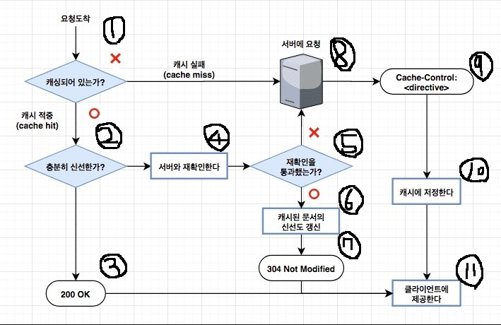

# Chapter 7. 웹 캐시(Web Cache)

# 1. 캐시란

<aside>
💡 캐싱 기본 개념 : 캐싱(Caching)은 애플리케이션의 처리 속도를 높여준다. 이미 가져온 데이터나 계산된 결과값의 **복사본을 저장**해 처리 속도를 향상시키며, 이를 통해 이후 요청을 더 빠르게 처리할 수 있다. 대부분의 프로그램이 동일한 데이터나 명령어에 반복해서 엑세스하기 때문에 캐싱은 효율적인 아키텍처 패턴이다.

웹 캐시 (Web Cache) : 사용자(client)가 웹 사이트(server)에 접속할 때, 정적 컨텐츠(이미지, JS, CSS 등)를 특정 위치(client, network 등)에 저장하여, 웹 사이트 서버에 해당 컨텐츠를 매번 요청하여 받는것이 아니라, 특정 위치에서 불러옴으로써 사이트 응답시간을 줄이고, 서버 트래픽 감소 효과를 볼 수 있다.

</aside>

# 2. 웹 캐시의 종류

1. **Browser Caches**
    - 모든 웹 브라우저에는 자체 내장 캐시가 있다. 웹페이지를 방문하면 브라우저는 웹페이지 Resource(HTML, CSS, JavaScript, 이미지 등)의 복사본을 로컬 장치(Memory or Disk)에 저장합니다. 동일한 페이지를 다시 방문하면 브라우저는 웹 서버에서 Resource를 요청하는 대신 캐시에서 로드합니다.
    - Cache된 Resource를 공유하지 않는 한 개인에 한정된 Cache

1. **Proxy Caches**
    - 프록시 캐시는 클라이언트와 웹 서버 사이의 중간 서버(프록시 서버)에서 사용됩니다. 이러한 프록시는 캐시된 콘텐츠를 저장하고 클라이언트에 제공하여 응답 시간을 향상시킵니다. 예에는 캐싱 모듈이 있는 Nginx 및 Apache와 같은 리버스 프록시가 포함됩니다.
    
2. etc

# 3. 캐시를 컨트롤 하는 방법

브라우저는 처음 요청한 파일에 대해서 이후 요청은 캐시를 사용합니다(모든 파일이 그렇다는 건 아님). 하지만 만약 캐시되지 않아야 하거나 캐시된 내용에 변경이 발생할 경우 컨트롤을 해줘야 합니다. 캐시를 컨트롤 하는 방법에는 크게 2가지가 있습니다.

1. **HTML Meta Tags**
    
    <META HTTP-EQUIV="EXPIRES" CONTENT="Mon, 22 Jul 2002 11:12:01 GMT"><META HTTP-EQUIV="CACHE-CONTROL" CONTENT="NO-CACHE">
    
    첫 번째 방법은 위와 같은 HTML Meta Tag를 페이지에 삽입하는 방법입니다. 하지만 이 방법은 과거의 몇몇 브라우저에게만 유효 했으며 지금은 더 이상 사용하지 않는 방법입니다.
    
2. HTTP Headers

|  |  HTTP 1.0 (1996년) |  | HTTP 1.1 (1999년) |  |
| --- | --- | --- | --- | --- |
|  | 요청(REQUEST) | 응답(RESPONSE) | 요청(REQUEST) | 응답(RESPONSE) |
| validation | If-Modified-Since | Last-Modified | If-None-Match | Entity Tag (Etag) |
| freshness | Pragma | Expires | Cache-Control | Cache-Control |

두 번째 방법은 HTTP Headers를 사용하는 방법으로 지금 저희가 사용하고 있는 방식입니다.

**파일이 이전과 비교하여 변경 되었는가를 체크하는 validation**과 **캐쉬의 만료 여부를 체크하는 freshness**로 구성됩니다.

request와 response에 따라 서로 사용될 수 있는 값이 다르며 HTTP1.0에서 HTTP1.1로 넘어오면서 약간의 변화가 있습니다. HTTP 1.1에서는 하위 호환되므로 1.0의 header를 사용하여도 정상 동작하지만 중복으로 선언된다면 1.1에 정의된 것이 우선순위를 가지게 됩니다.

예를 들어 **Last-Modified와 Etag가 동시에 있다면 Etag가 우선순위**를 가집니다. **Expires와 Cache-Control도 마찬가지** 입니다.

HTTP 1.1의 Cache-Control은 하나의 값이 아니라 다양한 지시자를 이용하여 값을 전달할 수 있습니다. 그로 인해 여러가지 컨트롤을 가능하게 만들어 줍니다. ex)Cache-Control:max-age=3600, must-revalidate

| 지시자 | 설명 |
| --- | --- |
| max-age=[sec] | Expires 와 동일한 의미지만 고정된 절대 시간 값이 아닌 요청 시간으로부터의 상대적 시간을 표시합니다. 
 명시된 경우
 |
| s-maxage=[sec] | max-age와 동일한 의미지만 shared caches(예:proxy)에만 적용됩니다.
 명시된 경우 max-age나 Expires보다 우선순위를 가집니다. |
| public | 일반적으로 HTTP인증이 된 상태에서 일어나는 응답은 자동으로 private이 됩니다.
 public을 명시적으로 설정하면 인증이 된 상태더라도 캐쉬 하도록 합니다.
 |
| private | 특정 유저(사용자의 브라우저)만 캐쉬 하도록 설정 합니다. 여러 사람이 사용하는 네트워크상의 중간자
 (intermediaries)역할을 하는 shared caches (예: proxy) 에는 경우 캐쉬되지 않습니다.
 |
| no-cache | 응답 데이터를 캐쉬하고는 있지만, 먼저 서버에 요청해서 유효성 검사(validation)을 하도록 강제 합니다. 
 어느 정도 캐쉬의 효용을 누리면서도 컨텐츠의 freshness를 강제로 유지하는데 좋습니다.
 |
| no-store | 어떤 상황에서도 해당 response 데이터를 저장하지 않습니다.
 |
| no-transform | 어떤 프록시들은 어떤 이미지나 문서들을 성능향상을 위해 최적화된 포맷으로 변환하는 등의 자동화된 동작을 
 하는데 이러한 것을 원치 않는다면 이 옵션을 명시해주는 것이 좋습니다.
 |
| must-revalidate | HTTP는 특정 상황(네트워크 연결이 끊어졌을 때 등)에서는 fresh하지 않은 캐쉬 데이터임에도 불구하고 사용하는  경우가 있는데, 금융거래 등의 상황에서는 이러한 동작이 잘못된 결과로 이어질 가능성이 있기 때문에 이 지시자를  통해서 그러한 사용을 방지합니다.
 |
| proxy-revalidate | must-revalidate와 비슷하지만 shared caches (예: proxy)에만 적용됩니다.
 |

# 4. 캐시가 처리되는 과정

캐싱이 일어나는 과정과 안 일어나는 과정 2가지 케이스로 예를 들겠습니다.

- 캐싱이 안 일어나는 과정
    
    .jpg)
    
    첫 요청 시 응답헤더에 캐시를 적용시키는 Cache-Control 같은 헤더가 없기에 캐싱되지 않습니다.
    
    .jpg)
    
    두번째에도 똑같은 요청을 했더라도 캐싱되어 있지 않기 때문에 서버에서 직접 받아와야 합니다.
    
    캐시 처리 순서로 보자면 ① → ⑧ → ⑪
    
    *9번과 10번은 캐싱 관련한 헤더가 없기에 무시되어 통과된다.
    
- 캐싱이 일어나는 과정
    
    .jpg)
    
    .jpg)
    
    첫 요청의 응답으로 60초의 해당하는 캐시를 저장합니다.
    
    .jpg)
    
    .jpg)
    
    .jpg)
    
    .jpg)
    
    만약 60초의 유효 시간이 초과된 이후 요청을 하게 되면 시간이 지났기 때문에 다시 서버에게 요청을 합니다.
    
    첫 요청 캐시 처리 순서로 보자면  **① → ⑧→ ⑨ → ⑩ → ⑪**
    
    두 번째 요청 캐시 처리 순서 : **① → ② → ③ → ⑪**
    
    세 번째 요청 캐시 처리 순서 : **① → ② → ④ → ⑤ → ⑧→ ⑨ → ⑩ → ⑪**
        *캐시된 문서가 만료되면, 캐시는 반드시 서버와 문서에 변경된 것이 있는지 검사해야 하며, 만약 그렇다면 신선한 사본을 얻어 와야 한다(새 유효기간과 함께)
    
    시간이 초과 되었지만 **서버의 데이터와 브라우저의 데이터가 변하지 않았을 경우**엔 서버로 다시 요청을 해서 데이터와 캐시를 갱신하기엔 너무 비효율적이다. 이번엔 **캐시 헤더 + 검증 헤더**를 포함해서 더 효과적인 방법을 알아보자.
    
    .jpg)
    
    .jpg)
    
    첫 요청 시 캐시 유효 시간과 요청한 데이터의 최종 수정일이 담겨져 있는 데이터를 캐시에 저장합니다.
    
    .jpg)
    
    두 번째 캐시 데이터 요청을 했을 때 캐시 유효 시간이 초과됐을 경우 다시 서버로 데이터 요청(데이터 및 캐시 갱신 요청)합니다.
    
    .jpg)
    
    두 번째 요청을 했을 땐 첫 요청시에 받았던 응답 헤더 중 Last-Modified의 데이터가 if-modified-since헤더의 값으로 담겨져 보냅니다.
    
    .jpg)
    
    .jpg)
    
    서버의 데이터 최종 수정일 시간과 캐시에 담겨져있는 데이터 최종 수정일이 같은 것을 확인하여 데이터가 아직 수정되지 않았다는 것을 알게됩니다.
    
    .jpg)
    
    그런 다음 서버에서는 304 Not Modified라는 변화가 없다는 리다이렉트 코드를 전송합니다. 이 때 저장되어있던 캐시를 사용하라고 할 것이기에 HTTP Body가 없습니다.
    
    .jpg)
    
    304 Not Modified가 담긴 요청 헤더만 클라이언트로 보내어 캐시의 유효 시간을 갱신합니다. 그리고 이후 클라이언트는 304라는 코드를 받은 후 다음과 같이 행동합니다.
    
    .jpg)
    
    첫 요청 캐시 처리 순서로 보자면 : **① → ⑧→ ⑨ → ⑩ → ⑪**
    
    두 번째 요청 캐시 처리 순서 : **① → ④ → ⑤ → ⑥ → ⑦ → ⑪**