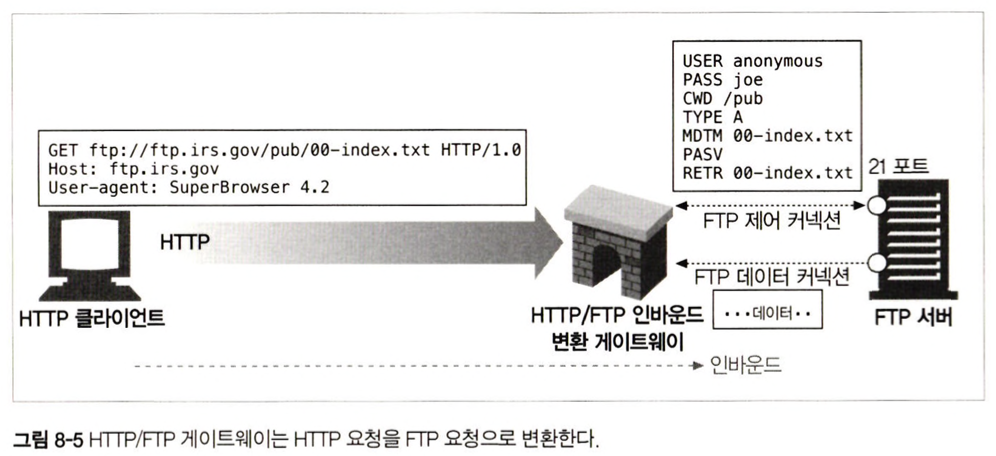
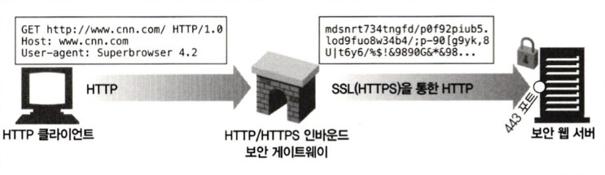
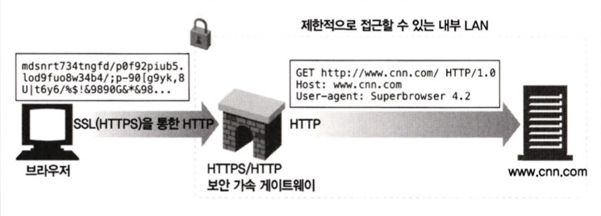
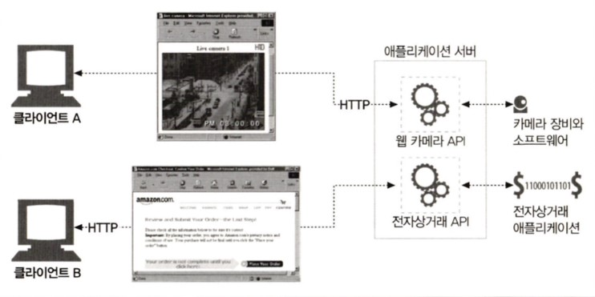
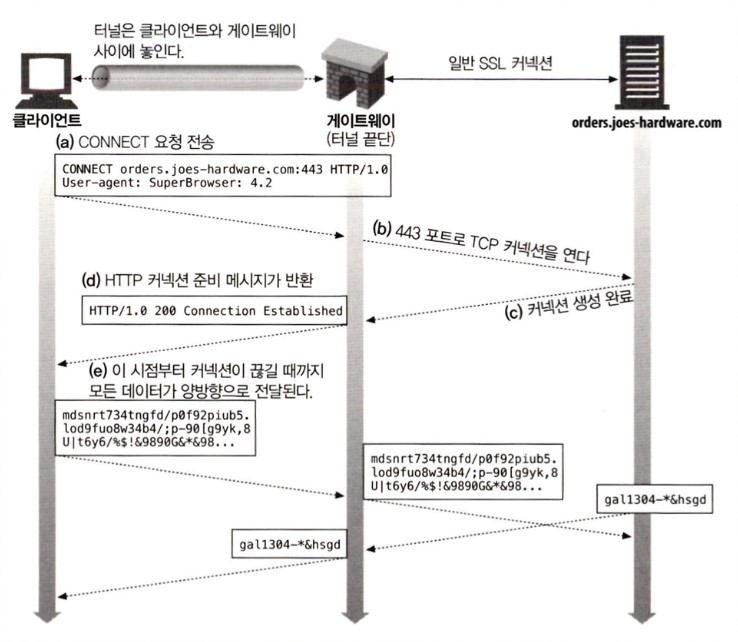

# Chapter 8. 통합점: 게이트웨이, 터널, 릴레이

# 1. 게이트웨이란

는 컴퓨터 네트워크에서 서로 다른 통신망, **프로토콜을 사용하는 네트워크 간의 통신을 가능하게** 하는 컴퓨터나 소프트웨어를 두루 일컫는 용어, 즉 다른 네트워크로 들어가는 입구 역할을 하는 네트워크 포인트이다. 넓은 의미로는 종류가 다른 네트워크 간의 통로의 역할을 하는 장치이다. 또한 게이트웨이를 지날 때마다 트래픽(traffic)도 증가하기 때문에 속도가 느려질 수 있다. 쉽게 예를 들자면 해외여행을 들 수 있는데 해외로 나가기 위해서 꼭 통과해야하는 공항이 게이트웨이와 같은 개념이다.

즉, 게이트웨이는 서로 다른 네트워크 상의 통신 프로토콜(protocol,통신규약)을 적절히 변환해주는 역할을 한다.

게이트웨이는 주로 HTTP 트래픽을 **다른 프로토콜로 변환하기 위해 사용**한다. 마치 게이트웨이는 언제나 스스로가 리소스를 갖고 있는 진짜 서버인 것처럼 요청을 다룬다. 클라이언트는 자신이 게이트웨이와 통신하고 있음을 알아채지 못한다.

두 컴퓨터가 네트워크 상에서 서로 연결되려면 동일한 통신 프로토콜을 사용해야 하는데, **만약 요청은 HTTP 요청이고 백엔드에서 데이터를 가져오려면 FTP 통신이 필요하다면 중간에 게이트웨이가 두 프로토콜을 호환가능하도록 HTTP->FTP, FTP->HTTP를 대신 해주는 대행자가 되는 것이다.**

## 1.1 일반적인 게이트웨이 종류

### 1.1.1 HTTP/FTP 게이트웨이

1. 클라이언트로부터 HTTP요청이 원 서버 영역으로 들어 오는 시점에 클라이언트 측 HTTP 요청을 게이트웨이가 외래 프로토콜(여기선 FTP)로 전환
2. 게이트웨이는 원 서버의 FTP 포트(21 포트)로 FTP커넥션을 연결하고 FTP 프로토콜을 통해 객체를 가져옴
    1. 2번 상세 과정
        1. USER와 PASS 명령을 보내 서버에 로그인하다
        2. 서버에서 적절한 디렉터리로 변경하기 위해 CWD 명령을 내린다.
        3. 다운로드 형식을 ASCII로 설정
        4. MDTM으로 문서의 최근 수정 시간을 가져온다.
        5. PASV로 서버에게 수동형 데이터 검색을 하겠다고 말한다.
        6. RETR로 객체를 검색한다.
        7. 제어 채널에서 반환된 포트로 FTP 서버에 데이터 커넥션을 맺는다. 데이터 채널이 열리는 대로 객체가 게이트웨이로 전송됨
3. 게이트웨이는 객체를 받는 대로 HTTP 응답 형식에 맞춰 클라이언트에게 전송한다.

### 1.1.2 HTTP/HTTPS 게이트웨이

기업 내부의 모든 웹 요청을 암호화해서 개인 정보 보호와 보안을 제공하는 게이트웨이를 사용할 수 있다. 클라이언트는 일반 HTTP를 사용해 웹을 탐색할 수 있지만 게이트웨이는 자동으로 사용자의 모든 세션을 암호화한다.

### 1.1.3 HTTPS/HTTP 게이트웨이

웹 서버의 앞에 위치하고 보이지 않는 인터셉트 게이트웨이나 리버스 프록시 역할을 한다. 이 게이트웨이트는 보안 HTTPS 트래픽을 받아서 복호화하고 웹 서버로 보낼 일반 HTTP 요청을 만든다.

이런 게이트웨이는 원 서버의 부하를 줄여주기도 한다. 하지만 이는 게이트웨이와 원 서버 간의 암호화하지 않은 트래픽을 전송하기 때문에 게이트웨이와 원 서버 간에 있는 네트워크가 안전한지 확인을 확실히 하고 사용해야 한다.

### 1.1.4 리소스 게이트웨이

애플리케이션 서버는 게이트웨이와 목적지 서버를 한 개의 서버로 결합하고 클라이언트와 HTTP로 통신한다.

# 2. 터널

웹 터널은 HTTP 프로토콜을 지원하지 않는 애플리케이션에 HTTP 애플리케이션을 사용해 접근하는 방법을 제공한다.

웹 터널을 사용하면 HTTP 커넥션을 통해 HTTP가 아닌 트래픽을 전송할 수 있고, 다른 프로토콜을 HTTP 위에 올릴 수 있다.

웹 터널을 사용하는 가장 일반적인 이유는 HTTP 커넥션 안에 HTTP가 아닌 트래픽을 얹기 위해서다.즉, 웹 터널을 사용하면 웹 트래픽만을 허락하는 방화벽이 있더라도 HTTP가 아닌 트래픽을 전송할 수 있다.

사용하기 위해선 HTTP의 CONNECT 메소드를 사용하여 커넥션을 맺는다.

# 3. 릴레이

HTTP 릴레이는 HTTP 명세를 완전히 준수하지 않는 간단한 HTTP 트록시다. 릴레이는 커넥션을 맺기 위한 HTTP통신을 한 다음, 바이트를 맹목적으로 전달한다.