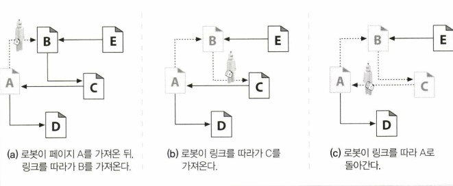
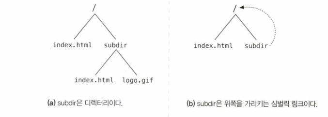
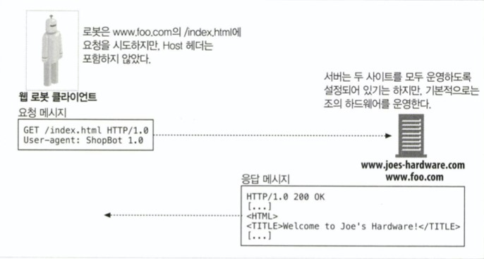
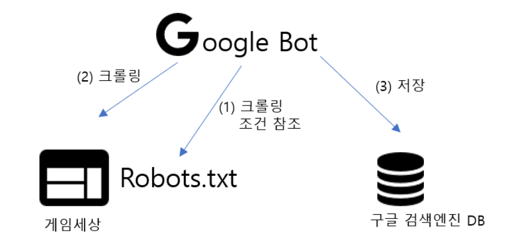
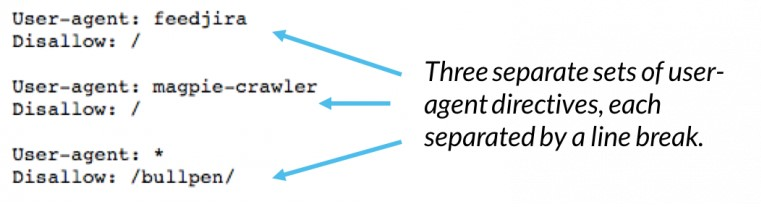

# Chapter 9. 웹 로봇

# 1. 웹 로봇(크롤러)이란

웹 로봇은 사람과의 상호작용 없이 연속된 웹 트랜잭션들을 자동으로 수행하는 **소프트웨어 프로그램**이다. 콘텐츠를 가져오고, 하이퍼링크를 따라가고, 그들(웹 로봇)이 발견한 데이터를 처리한다. 방식에 따라 ‘크롤러’, ‘스파이더’ 등으로 불리는데 여기서는 크롤러라고 부르겠다.

# 2. 크롤러의 기본 작업

웹 크롤러는 먼저 웹페이지를 한 개 가져오고, 그 다음 그 페이지가 가리키는 모든 웹페이지를 가져오고, 다시 그 페이지들이 가리키는 모든 웹페이지들을 가져온다. 즉, **재귀적으로 반복하는 방식**으로 웹을 순회하는 로봇이다.

인터넷 검색엔진은 웹을 돌아다니면서 그들이 만나는 모든 문서를 끌어오기 위해 크롤러를 사용한다.

# 3. 크롤러는 어떻게 작동하는가?

1. 크롤러에게 출발지점을 주어야 하는데 방문을 시작하는 URL들의 초기 집합을 루트 집합(root set)이라고 불린다.
2. 크롤러는 웹을 돌아다니면서 꾸준히 HTML 문서를 검색한다. 크롤러는 검색한 각 페이지 안에 들어있는 URL 링크들을 파싱해서 크롤링할 페이지들의 목록에 추가한다. HTML을 파싱을 해서 새 링크들을 추출한 **URL 상대 링크를 절대 링크로 변환해야 한다.**

# 4. 크롤러의 순환 케이스와 문제 해결 방안

## 4.1 URL 루프로 인한 순환



크롤러가 웹을 크롤링 할 때, 순환에 빠지지 않도록 조심해야 한다.

크롤러의 순환이 해로운 이유

- 루프를 허술하게 설계된 크롤러는 루프에 빠뜨려서 네트워크 대역폭을 다 차지하고 그 어떤 페이지도 가져올 수 없게 될 수 있다.
- 같은 페이지를 반복해서 가져오면 고스란히 웹 서버의 부담이 된다.
- 많은 수의 중복된 페이지들을 저장할 수 있다.

### 4.1.1 방문한 곳을 관리하기 위한 기법들

트리와 해시 테이블

방문한 URL을 추적하기 위해 검색 트리나 해시 테이블을 사용할 수 있다.

느슨한 존재 비트맵

공간 사용을 최소화하기 위해 존재 비트 배열(presence bit array)과 같은 느슨한 자료 구조를 사용한다. **URL을 해시 함수를 통해 고정된 크기의 숫자로 변환**되고 해열 안에 대응하는 존재 비트를 갖는다.

체크포인트

크롤러가 갑자기 중단될 경우를 대비해 방문한 URL의 목록이 디스크에 저장되었는지 확인한다.

파티셔닝

각각이 분리된 한대의 컴퓨터의 로봇들이 URL들의 특정 ‘한 부분’을 할당되어 책임을 지고 각각은 서로 도와 웹 크롤링을 한다.

## 4.2 별칭(Alias)으로 인한 순환

URL이 별칭을 가질 때, 어떤 페이지를 이전에 방문했었는지 확인이 쉽지 않을 때도 있다. 한 URL이 또 다른 URL에 대한 별칭이라면 다른 주소라도 같은 리소스를 가리키고 있을 수 있다.

| 첫 번째 URL | 두 번째 URL | 어떤 경우에 같은 URL을 가리키게 되는가? |
| --- | --- | --- |
| http://www.foo.com/bar.html | http://www.foo.com:80/bar.html | 기본 포트가 80번일 때 |
| http://www.foo.com/~fred | http://www.foo.com/%7Ffred | %7F이 ~과 같을 때 |
| http://www.foo.com/x.html#early | http://www.foo.com/x.html#middle | 태그에 따라 페이지가 바뀌지 않을 때 |
| http://www.foo.com/readme.html | http://www.foo.com/README.HTML | 서버가 대소문자를 구분하지 않을 때 |
| http://www.foo.com/ | http://www.foo.com/index.html | 기본 페이지가 index.html일 때 |
| http://www.foo.com/index.html | http://209.231.87.45/index.html | www.foo.com이 아이피 주소를 가질 때 |

## 4.3 심볼릭(symbolic) 링크로 인한 순환

파일 시스템의 심볼릭 링크는 사실상 아무것도 존재하지 않으면서도 끝없이 깊어지는 디렉터리 계층을 만들 수 있다.



## 4.4 순환을 피해 올바르게 동작하기 위한 기법들

1. URL 정규화
    - URL들을 표준 형식으로 ‘정규화’ 함으로써 같은 리소스를 가리키는 중복된 URL이 생기는 것을 회피한다.
        - 포트 번호가 명시되지 않았다면, 호스트 명에 ‘:80’을 추가한다.
        - 모든%xx 이스케이핑된 문자들을 대응되는 문자로 변환한다.
        - # 태그들을 제거한다.

1. 너비 우선 크롤링
    - 크롤러들은 언제든지 크롤링을 할 수 있는 URL들의 큰 집합을 갖고 있다. 방문할 URL들을 웹 사이트들 전체에 걸쳐 **너비 우선으로 스케줄링**하면, 순환의 영향을 최소화할 수 있다.

1. 스로틀링
    - 일정 시간 동안 가져올 수 있는 페이지의 숫자를 제한한다. 스로틀링을 이용해 그 서버에 대한 접근 횟수와 중복의 총 횟수를 제한할 수 있다.

1. URL 크기 제한
    - 일정 길이(보통 1KB)를 넘는 URL을 거부할 수 있다. 순환으로 인해 URL이 계속 길어진다면 길이 제한으로 인해 순환이 중단된다.
    이 기법을 적용하면 가져오지 못하는 콘텐츠들도 생길 수 있다.

1. URL/사이트 블랙리스트
    - 문제를 일으키는 사이트나 URL이 발견될 때마다 블랙리스트에 추가한다.

1. 패턴 발견
    - 반복되는 구성요소를 가진 URL을 잠재적인 순환으로 보고, 둘 혹은 셋 이상의 반복된 구성요소를 갖고 있는 URL을 크롤링하는 것을 거부한다.
    - 몇몇 크롤러는 몇 가지 다른 주기의 반복 패턴을 감지한다.

1. 콘텐츠 지문(fingerprint)
    - 콘텐츠 지문을 사용하는 로봇들은 페이지의 콘텐츠에서 몇 바이트를 얻어내 체크섬(checksum)을 계산한다. 이 체크섬은 그 페이지 내용의 간략한 표현이다.
    - 로봇이 **이전에 보았던 체크섬을 가진 페이지를 가져온다면**, 그 페이지의 링크는 크롤링하지 않는다.
    - 어떤 웹 서버들은 동적으로 그때그때 페이지를 수정하기 때문에, 로봇들은 때때로 웹페이지 콘텐츠에 임베딩된 링크와 같은 특정 부분들을 체크섬 계산에 빠뜨린다. 또한 페이지 콘텐츠를 임의로 커스터마이징하는 것(날짜 추가, 카운터 접근 등)을 포함한 서버 측의 동적인 동작은 중복 감지를 방해할 수 있다.
    
2. 사람의 모니터링

# 5. 웹 로봇(크롤러)의 요청과 응답

로봇들은 다른 HTTP 클라이언트 프로그램과 다르지 않다. 그들 또한 HTTP 명세의 규칙을 지켜야 한다. HTTP 요청을 만들고 적절한 HTTP 요청 헤더를 사용해야 한다.

많은 로봇이 그들이 찾는 콘텐츠를 요청할 때 필요한 HTTP를 최소한으로만 사용해 요청하고 싶기에 많은 로봇들이 요구사항이 적은 HTTP/1.0 요청을 보낸다.

## 5.1 웹 로봇의 요청

로봇들은 약간의 신원 식별 헤더를 구현하고 전송한다.

- User-Agent
    - 서버에게 요청을 만든 로봇의 이름을 말해준다.

- From
    - 로봇의 사용자/관리자의 이메일 주소를 제공한다.

- Accept
    - 서버에서 어떤 미디어 타입을 보내도 되는지 말해준다. 이 헤더는 로봇이 관심 있는 유형의 콘텐츠만 받게 될 것임을 확신하는데 도움을 준다.

- Referer
    - 현재의 요청 URL을 포함한 문서의 URL을 제공한다.
    - 서버입장에서 로봇이 어떻게 그들 사이트의 콘텐츠에 대한 링크를 발견했는지 알아내고 싶은 사이트 관리자들에게 매우 유용하다.

HTTP/1.1에서는 Host 헤더를 요구한다. 가상 호스팅이 퍼져있는 현실에서 요청에 Host 헤더를 포함하지 않으면 로봇이 어떤 URL에 대해 잘못된 콘텐츠를 찾을 수 있다.

두 개의 사이트를 운영하는 서버가 있을 경우 Host 헤더를 포함하지 않은 요청을 했을 때, 원하지 않은 리소스를 받을 수 있다.



## 5.2 웹 로봇의 응답

대다수의 로봇들은 GET 메소드로 콘텐츠를 요청해서 가져온다. 그렇기에 HTTP 응답을 잘 다룰 줄 알아야 한다.

1. 상태코드
    - 일반적인 상태 코드나 예상할 수 있는 200 OK나 404 Not Found 같은 상태 코드를 이해해야 한다.
    - 모든 서버가 언제나 항상 적절한 에러 코드를 반환하지는 않는다는 걸 알야둬야 한다. **몇몇 서버는 에러를 기술하는 메시지조차 200 OK로 응답하기도 한다.**

1. 엔터티
    - 로봇 구현자들은 http-equiv 정보를 찾아내기 위해 HTML 문서의 HEAD 태그를 탐색하기를 원할 수 있다.
    
    <aside>
    💡 <meta> 태그의 http-equiv 속성은 content 속성에 명시된 값에 대한 HTTP 헤더를 제공합니다.
    
    http-equiv 속성은 HTTP 응답 헤더를 시뮬레이션할 때 사용할 수 있습니다.
    
    **만약 http-equiv 속성이 명시되어 있다면, 반드시 content 속성도 함께 명시되어야만 합니다.**
    
    ex) <meta http-equiv="refresh" content="5; url=http://이동할주소">
    
    </aside>
    

# 6. 잘못된 설계로 인한 부정적인 결과들

1. 폭주하는 로봇
    - 로봇은 빠른 네트워크 연결을 갖춘 빠른 컴퓨터 위에서 동작해 웹 서핑을 하는 사람보다 빠른 요청을 할 수 있는데, 만약 논리적인 에러를 갖고 있거나 순환에 빠졌다면 웹 서버에 극심한 과부하를 안겨줄 수 있다.

1. 오래된 URL
    - 몇몇 로봇은 URL의 목록을 방문하는데, 만약 웹 사이트가 그들의 콘텐츠를 많이 바꾸었다면 로봇들은 존재하지 않는 URL에 대한 요청을 많이 보낼 수 있다. 존재하지 않는 문서의 요청으로 인해 서버는 에러 로그가 채워지거나, 요청에 대한 수용 능력이 감소될 수 있다.

1. 길고 잘못된 URL
    - 순환이나 프로그래밍상의 오류로 인해 웹 서버에게 크고 의미 없는 URL을 요청할 수 있는데 이는 웹 서버의 처리 능력에 영향을 주거나 고장을 일으킬 수 있다.

1. 호기심이 지나친 로봇
    - 어떤 로봇들은 사적인 데이터에 대한 URL을 얻어 그 데이터를 인터넷 검색엔진이나 기타 애플리케이션을 통해 쉽게 접근할 수 있도록 만들 수도 있다.
    보통 이는 사적인 콘텐츠에 대한 이미 존재하는 하이퍼링크를 로봇이 따라감으로 벌어지는 일이다.
    이러한 일은 로봇이 명시적으로는 **하이퍼링크가 존재하지도 않는 문서들을 디렉토리의 콘텐츠를 가져오는 등의 방법**으로 긁어올 때 일어난다.

1. 동적 게이트웨이 접근
    - 로봇은 게이트웨이 애플리케이션의 콘텐츠에 대한 URL로 요청 할 수도 있다. 이 경우 얻은 데이터는 아마 특수 목적을 위한 것일 테고 처리 비용이 많이 들 것이다.

# 7. 로봇 차단하기

로봇이 서버에게 맞지 않는 장소에 들어오지 않도록 하고 웹 마스터에게 로봇의 동작을 더 잘 제어할 수 있는 메커니즘을 제공하는 단순하고 자발적인 기법이 제안되었다.
로봇의 접근을 제어하는 정보를 저장하는 파일의 이름 따서 robots.txt라 부른다.

## 7.1 robots.txt의 기본적인 메커니즘

웹 서버는 서버의 **문서 루트에** robots.txt라고 이름 붙은 선택적인 파일을 제공할 수 있다. 이 파일은 어떤 로봇이 서버의 어떤 부분에 접근할 수 있는지에 대한 정보를 담는다. 만약 어떤 로봇이 이 자발적인 표준에 따른다면, 그것은 웹 사이트의 어떤 **다른 리소스에 접근하기 전에 우선 그 사이트의 robots.txt를 요청한다.** 



## 7.2 로봇의 robots.txt의 처리방식

웹 사이트의 어떤 URL을 방문하기 전에, 그 웹 사이트의 docroot에 robots.txt 파일이 존재한다면 로봇은 반드시 그 파일을 가져와서 처리해야 한다. 호스트 명과 포트번호에 의해 정의되는 어떤 웹 사이트가 있을 때, **그 사이트 전체의 대한 robots.txt 파일은 단 하나만 존재한다.**

### 7.2.1 robots.txt가져오기

로봇은 웹 서버의 여느 파일들과 마찬가지로 HTTP GET 메소드를 이용해 robots.txt 리소스를 가져온다. robots.txt가 존재한다면 서버는 그 파일을 **반드시 text/plain 본문으로 반환해야한다.** 만약 서버가 404(Not Found) 상태 코드로 응답한다면 로봇은 그 서버는 로봇의 접근을 제한하지 않는 것으로 간주하고 어떤 파일이든 요청하게 된다.

로봇은 사이트 관리자(서버)가 로봇의 접근을 추적할 수 있도록 From이나 User-Agent헤더를 통해 신원 정보를 넘겨야 한다. 

<aside>
💡 **<HTTP 크롤러 요청 예>**
GET / robots.txt HTTP/1.0
Host: www.example.com
User-Agent: GoogleBot
Date: Wed Oct 3 00:00:00 EST 2001

</aside>

### 7.2.2 응답 코드

로봇은 어떤 웹 사이트든 반드시 robots.txt를 찾아본다. 로봇은 robots.txt의 검색 결과에 따라 다르게 동작한다.

|  | 응답 코드 그룹 | 설명 |
| --- | --- | --- |
| 2xx | Successful | 서버가 성공(HTTP 상태 코드 2XX)으로 응답하면 그 응답의 콘텐츠를 파싱하여 차단 규칙을 얻고, 그 사이트에서 무언가를 가져오려 할 때 그 규칙에 따르게 된다.
만약 robots.txt가 HTML 문서로 반환된다면 그 안에 유효한 규칙이 있더라도 robots.txt가 없음(모두 허용)으로 해석될 수 있으므로 텍스트 파일 (text/plain)로 작성해야 한다. |
| 3xx | Redirection | 서버 응답이 리다이렉션 (HTTP 상태 코드 3XX)이라면 로봇은 리소스가 발견될 때까지 리다이렉션을 따라가야 한다.
하지만 각각의 크롤러들마다 기준이 있다. |
| 4xx | Client Error | 만약 리소스가 존재하지 않는다고 서버가 응답 (HTTP 상태 코드 4XX) 하면 로봇은 규칙이 존재하지 않는다고 가정하고 robots.txt의 제약 없이 (모두 허용) 사이트에 접근할 수 있다. |
| 5xx | Server Error | 요청이 실패했다면 (HTTP 상태 코드 5XX) 로봇은 그 사이트의 리소스를 검색하는 것을 뒤로 미루어야 한다.
하지만 각각의 크롤러들마다 기준이 있다. |

*참고 : [https://searchadvisor.naver.com/guide/seo-basic-robots](https://searchadvisor.naver.com/guide/seo-basic-robots)
[https://developers.google.com/search/docs/crawling-indexing/robots/robots_txt?hl=ko](https://developers.google.com/search/docs/crawling-indexing/robots/robots_txt?hl=ko)

## 7.3 robots.txt 파일 포맷

robots.txt 파일은 매우 단순한 줄 기반 문법을 갖는다.

robots.txt의 줄들은 레코드로 구분된다. 각 레코드는 규칙 줄들의 집합으로 되어 있으며 **빈 줄이나 파일 끝 문자로 끝난다.** 레코드는 어떤 로봇이 이 레코드에 영향을 받는지 지정하는 하나 이상의 User-Agent 줄로 시작하며 뒤이어 이 로봇들이 접근 혹은 비접근을 할 수 있는 URL들을 말해주는 Allow 줄과 Disallow 줄이 온다.



**지원하는 필드**

- `user-agent`: 규칙이 적용되는 크롤러를 식별합니다.
- `allow`: 크롤링할 수 있는 URL 경로입니다.
- `disallow`: 크롤링할 수 없는 URL 경로입니다.

**robots.txt를 이용한 예시**

만약 모든 로봇에게 문서 접근을 허락하려면, robots.txt에 다음과 같이 입력하면 된다.

```
User-agent: *
Allow: /
```

모든 로봇을 차단하려면, robots.txt에 다음과 같이 입력하면 된다.

```
User-agent: *
Disallow: /
```

모든 로봇에 세 디렉터리 접근을 차단하려면, robots.txt에 다음과 같이 입력하면 된다.

```
User-agent: *
Disallow: /cgi-bin/
Disallow: /tmp/
Disallow: /junk/
```

모든 로봇에 특정 파일 접근을 차단하려면, robots.txt에 다음과 같이 입력하면 된다.

```
User-agent: *
Disallow: /directory/file.html
```

BadBot 로봇에 모든 파일 접근을 차단하려면, robots.txt에 다음과 같이 입력하면 된다.

```
User-agent: BadBot
Disallow: /
```

BadBot 과 Googlebot 로봇에 특정 디렉터리 접근을 차단하려면, robots.txt에 다음과 같이 입력하면 된다.

```
User-agent: BadBot
User-agent: Googlebot
Disallow: /private/
```

여러 레코드를 조합하여 사용할 수 있다.

```
User-agent: googlebot        # googlebot 로봇만 적용
Disallow: /private/          # 이 디렉토리를 접근 차단한다.

User-agent: googlebot-news   # googlebot-news 로봇만 적용
Disallow: /                  # 모든 디렉토리를 접근 차단한다.

User-agent: *                # 모든 로봇 적용
Disallow: /something/        # 이 디렉토리를 접근 차단한다.
```

## 7.4 robots.txt의 캐싱과 만료

로봇은 주기적으로 robots.txt를 가져와서 그 결과를 캐시해야 한다. robots.txt의 캐시된 사본은 robots.txt 파일이 만료될 때까지 로봇에 의해 사용된다. robots.txt 파일의 캐싱을 제어하기 위해 표준 HTTP 캐시 제어 메커니즘이 원 서버와 로봇 양쪽 모두에 의해 사용된다. 로봇은 HTTP 응답의 Cache-Control과 Expires 헤더에 주의를 기울여야 한다. 

오늘날 많은 크롤러 제품들은 HTTP/1.1 클라이언트가 아니다. 이 크롤러들이 robots.txt 리소스에 적용되는 캐시 지시자를 이해하지 못할 수도 있다는 점을 주의해야 한다.

## 7.5 로봇 HTML META 태그

HTML 문서에 직접 로봇 제어 태그를 추가할 수 있다.

|  | 설명 | 예시 |
| --- | --- | --- |
| NOINDEX | 로봇에게 해당 페이지를 처리하지 말고 무시하라고 말해준다.(해당 페이지의 콘텐츠를 색인이나 데이트베이스에 포함시키지 말것) | <meta name=”robots” content=”noindex”> |
| NOFOLLOW | 로봇에게 해당 페이지가 링크한 페이지를 크롤링하지 말라고 말해준다. | <meta name=”robots” content=”nofollow”> |
| INDEX | 로봇에게 해당 페이지의 콘텐츠를 인덱싱해도 된다고 말해준다. |  |
| FOLLOW | 로봇에게 해당 페이지가 링크한 페이지를 크롤링해도 된다고 말해준다. |  |
| NOARCHIVE | 로봇에게 해당 페이지의 캐시를 위한 로컬 사본을 만들어서는 안 된다고 말해준다. |  |
| ALL | INDEX, FOLLOW와 같다. |  |
| NONE | NOINDEX, NOFOLLOW와 같다. |  |

## 검색엔진 META 태그

|  | 설명 | 예시 |
| --- | --- | --- |
| DESCRIPTION | 저자가 웹페이지의 짧은 요약을 정의할 수 있게 해준다. 많은 검색엔진이 페이지 저자가 그들의 웹페이지에 대해 기술하는 짧고 적절한 요약을 지정할 수 있도록 해주는 meta description태그를 살펴본다. | <meta name=”description” content=”어서오세요. 환영합니다”> |
| KEYWORDS | 키워드 검색을 돕기 위한 웹페이지를 기술하는 단어들의 쉼표로 구분되는 목록 | <meta name=”keywords” content=”HI, Hello”> |
| REVISIT-AFTER | 로봇이나 검색엔진에게 해당 페이지는 아마도 쉽게 변경될 것이기 때문에 지정된 만큼의 날짜가 지난 이후에 다시 방문해야 한다고 지시한다. | <meta name=”revisit-after” content=”10 days”> |

# 8. 검색엔진

인터넷 검색엔진은 사용자가 전 세계의 어떤 주제에 대한 문서라도 찾을 수 있게 해 준다.
오늘날 검색엔진들은 그들이 갖고 있는 전 세계의 웹페이지들에 대해 ‘풀 텍스트 색인(full-text indexes)’이라고 하는 복잡한 로컬 데이터베이스를 생성한다. 이 색인은 웹의 모든 문서의 대한 일종의 카드 카탈로그처럼 동작한다. 검색엔진 크롤러들은 웹페이지들을 수집하여 서버에 가져와서, 이 풀 텍스트 색인에 추가한다.

풀 텍스트 색인 : 단어 하나를 입력받아 그 단어를 포함하고 있는 문서를 즉각 알려줄 수 있는 데이터베이스.